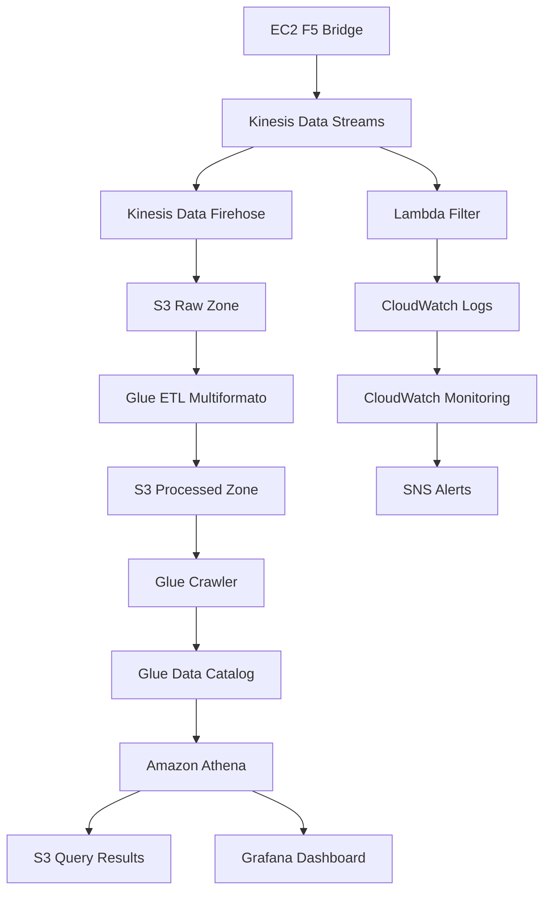
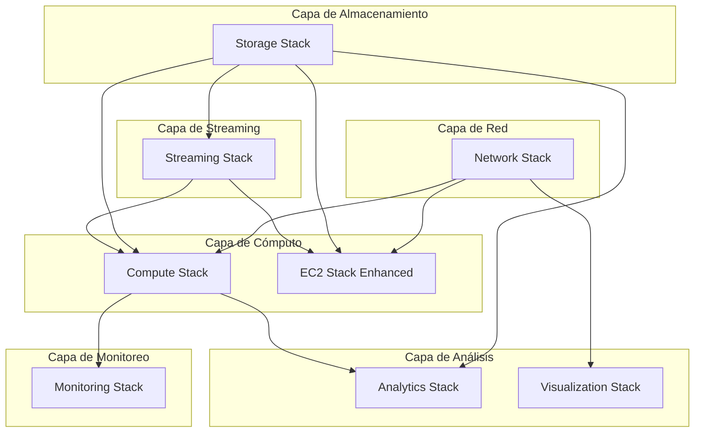

# Arquitectura AWS Data Lake - AGESIC

## Descripción General

Este proyecto implementa una arquitectura de Data Lake robusta en AWS para el procesamiento de logs F5 con capacidades ETL multiformato. La solución está diseñada siguiendo las mejores prácticas de AWS Well-Architected Framework y utiliza una arquitectura Medallion (Bronze, Silver, Gold) para el procesamiento de datos.

## Flujo Principal de Datos

## Arquitectura de Stacks CDK

La solución está organizada en 8 stacks principales que se despliegan en orden específico:

## Componentes Principales

### Ingesta de Datos
- **EC2 F5 Bridge**: Instancia EC2 con Kinesis Agent y Fluentd para captura de logs F5
- **Kinesis Data Streams**: Streaming en tiempo real con capacidad OnDemand
- **Kinesis Data Firehose**: Delivery optimizado a S3 con buffer inteligente

### Procesamiento ETL
- **AWS Glue ETL Multiformato**: Job ETL que detecta automáticamente formato JSON vs texto plano
- **Lambda Filter**: Filtrado de logs ERROR/WARN/CRITICAL/FATAL en tiempo real
- **Glue Crawlers**: Catalogación automática cada 24 horas

### Almacenamiento
- **S3 Raw Zone**: Datos originales en formato JSON.GZIP
- **S3 Processed Zone**: Datos transformados en formato Parquet con compresión Snappy
- **S3 Query Results**: Resultados de consultas Athena

### Análisis y Visualización
- **Amazon Athena**: Consultas SQL serverless con 7 queries F5 predefinidas
- **Grafana OSS**: Dashboard de visualización con métricas F5
- **Glue Data Catalog**: Catálogo de metadatos con esquema de 33 campos

### Monitoreo y Alertas
- **CloudWatch**: Métricas, logs y alarmas específicas F5
- **SNS**: Notificaciones de alertas por email
- **CloudWatch Dashboard**: Dashboard F5 Analytics con métricas en tiempo real

## Características Técnicas

### ETL Multiformato
- Detección automática de formato (JSON vs texto plano)
- Regex F5 validada al 100% para logs de texto
- Fallback inteligente entre formatos
- 33 campos enriquecidos (22 F5 originales + 11 derivados)

### Particionamiento Inteligente
- Particionamiento por año/mes/día/hora
- Partición especial para errores (errors/)
- Optimización de consultas Athena

### Seguridad
- Cifrado S3 con claves administradas por AWS
- VPC con subnets públicas y privadas
- Security Groups restrictivos
- Roles IAM con principio de menor privilegio
- SSL/TLS enforced en todos los buckets

### Escalabilidad
- Kinesis OnDemand para auto-scaling
- Glue ETL con Spark 3.5.4 optimizado
- EC2 Spot instances para reducir costos
- Lifecycle policies para optimización de almacenamiento

## Orden de Despliegue

1. **Network Stack**: VPC, Security Groups, VPC Endpoints
2. **Storage Stack**: Buckets S3 con políticas de lifecycle
3. **Streaming Stack**: Kinesis Data Streams y Firehose
4. **Compute Stack**: Lambda, Glue ETL y Crawlers
5. **Analytics Stack**: Athena Workgroup y queries predefinidas
6. **Monitoring Stack**: CloudWatch y SNS para alertas
7. **EC2 Stack Enhanced**: Instancias EC2 para F5 Bridge
8. **Visualization Stack**: Grafana para dashboards

## Métricas y Monitoreo

### Alarmas CloudWatch (8 alarmas específicas F5)
- Kinesis No Incoming Records
- Kinesis High Iterator Age
- Lambda F5 Error Rate
- Lambda F5 Duration
- Glue ETL Multiformat Failures
- F5 Average Response Time
- F5 Error Rate
- F5 Pool Health Score

### Dashboard F5 Analytics
- Request Volume & Error Rate
- Response Time Metrics (Avg, P95)
- Pool Health Score
- Processing Pipeline Health
- Traffic Distribution (móvil y caché)

## Queries Athena Predefinidas

1. **F5 Error Analysis Enhanced**: Análisis detallado de errores por BigIP/Pool
2. **F5 Performance Analysis Comprehensive**: Métricas de performance con percentiles
3. **F5 Traffic Distribution by Infrastructure**: Distribución por componentes F5
4. **F5 Client Behavior Analysis**: Análisis de comportamiento con detección móvil
5. **F5 Content Performance Optimization**: Optimización de caché por tipo de contenido
6. **F5 Hourly Infrastructure Summary**: Resumen horario operacional
7. **F5 Pool Health Monitoring**: Monitoreo de salud con scoring automático

## Costos Estimados

**Costo mensual estimado**: USD $45.80

### Desglose por servicio:
- Kinesis Data Streams: $11.00
- Kinesis Data Firehose: $8.50
- AWS Glue ETL: $12.30
- Lambda: $2.00
- S3 Storage: $5.00
- Athena: $3.00
- CloudWatch: $4.00

## Resultados Validados

### ETL Multiformato - Éxito Confirmado
- 299 registros procesados: 100% de los datos F5 originales
- Formato Parquet optimizado: 31,717 bytes con compresión Snappy
- Particionamiento inteligente: Por año/mes/día/hora
- Esquema completo: 33 campos con tipos de datos correctos
- Tabla f5_logs creada: Catalogada exitosamente por crawler

### Campos Procesados (33 total)

#### Campos F5 Originales (22)
- timestamp_syslog, hostname, ip_cliente_externo, ip_red_interna
- usuario_autenticado, identidad, timestamp_apache
- metodo, recurso, protocolo, codigo_respuesta, tamano_respuesta
- referer, user_agent, tiempo_respuesta_ms, edad_cache
- content_type, campo_reservado_1, campo_reservado_2
- ambiente_origen, ambiente_pool, entorno_nodo

#### Campos Derivados para Analytics (11)
- parsed_timestamp_syslog, parsed_timestamp_apache
- is_error, status_category, is_slow, response_time_category
- is_mobile, content_category, cache_hit
- processing_timestamp, etl_version

## Documentación de Stacks

Para información detallada de cada stack, consulte:

- [Network Stack](./network-stack-README.md)
- [Storage Stack](./storage-stack-README.md)
- [Streaming Stack](./streaming-stack-README.md)
- [Compute Stack](./compute-stack-README.md)
- [Analytics Stack](./analytics-stack-README.md)
- [Monitoring Stack](./monitoring-stack-README.md)
- [EC2 Stack Enhanced](./ec2-stack-enhanced-README.md)
- [Visualization Stack](./visualization-stack-README.md)
