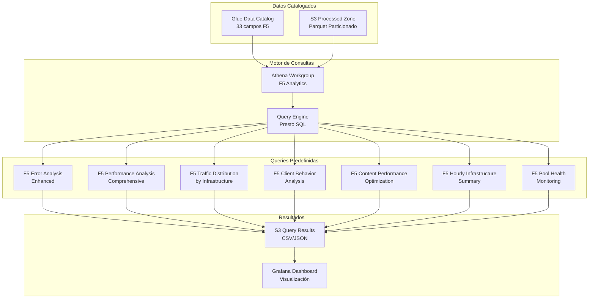
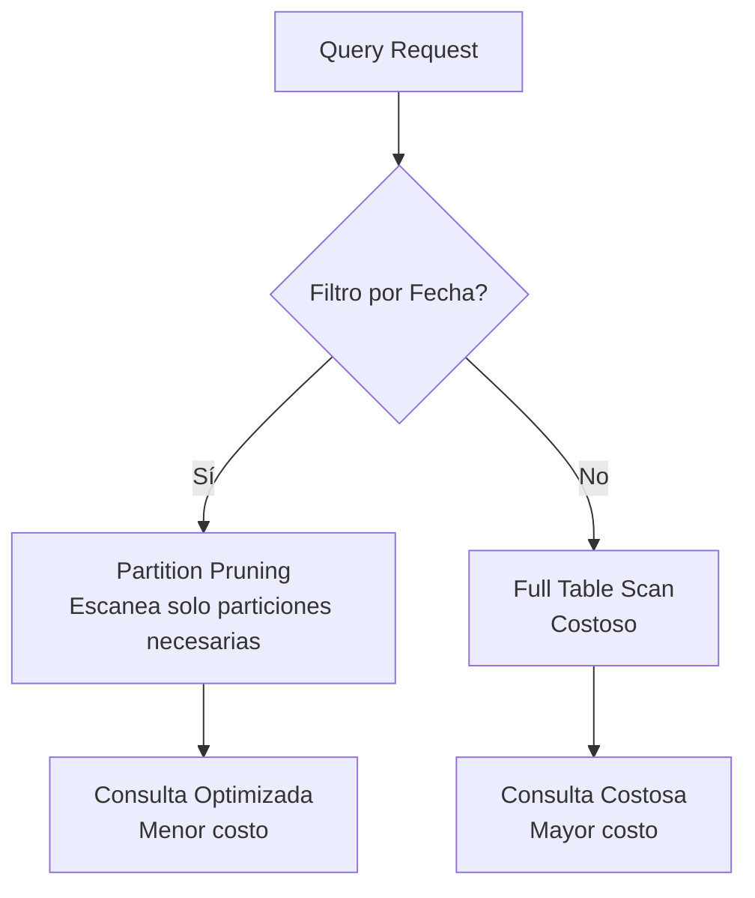
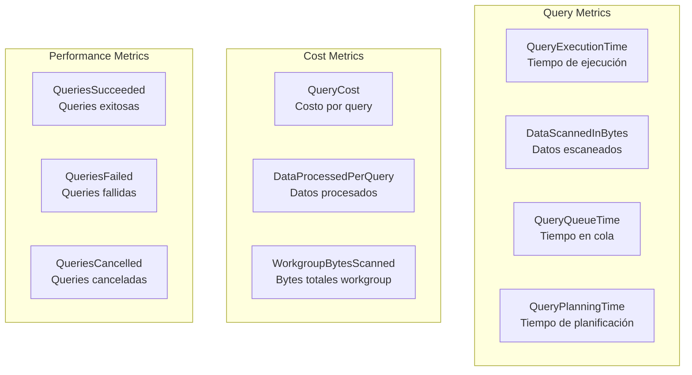

# Analytics Stack - Infraestructura de Análisis

## Descripción

El Analytics Stack proporciona capacidades de análisis SQL serverless utilizando Amazon Athena con queries F5 predefinidas, workgroups optimizados y integración con el Glue Data Catalog. Permite análisis interactivo y programático de los datos procesados del Data Lake.

## Arquitectura de Analytics



## Componentes Principales

### Athena Workgroup F5 Analytics
- **Nombre**: `agesic-dl-poc-f5-analytics-wg-{suffix}`
- **Propósito**: Workgroup dedicado para análisis F5
- **Configuración**: Optimizado para consultas de logs F5

#### Configuración del Workgroup
```yaml
workgroup_configuration:
  name: "agesic-dl-poc-f5-analytics-wg"
  description: "Workgroup optimizado para análisis de logs F5"
  
  result_configuration:
    output_location: "s3://agesic-dl-poc-athena-results/f5-analytics/"
    encryption_option: "SSE_S3"
    
  engine_version:
    selected_engine_version: "Athena engine version 3"
    
  publish_cloudwatch_metrics: true
  enforce_workgroup_configuration: true
  
  bytes_scanned_cutoff_per_query: 1073741824  # 1GB limit
```

### Base de Datos Glue
- **Nombre**: `agesic_dl_poc_database`
- **Tablas**: 
  - `f5_logs`: Tabla principal con 33 campos
  - `f5_logs_raw`: Tabla de datos originales (JSON)

#### Esquema de Tabla F5 Logs
```sql
CREATE EXTERNAL TABLE `f5_logs` (
  -- Campos F5 Originales (22)
  `timestamp_syslog` string,
  `hostname` string,
  `ip_cliente_externo` string,
  `ip_red_interna` string,
  `usuario_autenticado` string,
  `identidad` string,
  `timestamp_apache` string,
  `metodo` string,
  `recurso` string,
  `protocolo` string,
  `codigo_respuesta` int,
  `tamano_respuesta` int,
  `referer` string,
  `user_agent` string,
  `tiempo_respuesta_ms` int,
  `edad_cache` int,
  `content_type` string,
  `campo_reservado_1` string,
  `campo_reservado_2` string,
  `ambiente_origen` string,
  `ambiente_pool` string,
  `entorno_nodo` string,
  
  -- Campos Derivados (11)
  `parsed_timestamp_syslog` timestamp,
  `parsed_timestamp_apache` timestamp,
  `is_error` boolean,
  `status_category` string,
  `is_slow` boolean,
  `response_time_category` string,
  `is_mobile` boolean,
  `content_category` string,
  `cache_hit` boolean,
  `processing_timestamp` timestamp,
  `etl_version` string
)
PARTITIONED BY (
  `year` string,
  `month` string,
  `day` string,
  `hour` string
)
STORED AS PARQUET
LOCATION 's3://agesic-dl-poc-processed-zone/f5-logs/'
```

## Queries F5 Predefinidas (7 queries)

### 1. F5 Error Analysis Enhanced
```sql
-- Análisis detallado de errores por BigIP, VirtualServer y Pool
SELECT 
    ambiente_origen as bigip_device,
    ambiente_pool as pool_name,
    entorno_nodo as virtual_server,
    codigo_respuesta as status_code,
    status_category,
    COUNT(*) as error_count,
    AVG(tiempo_respuesta_ms) as avg_response_time,
    PERCENTILE_APPROX(tiempo_respuesta_ms, 0.95) as p95_response_time,
    MIN(parsed_timestamp_apache) as first_error,
    MAX(parsed_timestamp_apache) as last_error
FROM f5_logs 
WHERE is_error = true
    AND year = '2024' 
    AND month = '08'
GROUP BY ambiente_origen, ambiente_pool, entorno_nodo, codigo_respuesta, status_category
ORDER BY error_count DESC, avg_response_time DESC
LIMIT 100;
```

### 2. F5 Performance Analysis Comprehensive
```sql
-- Análisis de performance con percentiles por componente F5
SELECT 
    ambiente_origen as bigip_device,
    ambiente_pool as pool_name,
    response_time_category,
    COUNT(*) as request_count,
    AVG(tiempo_respuesta_ms) as avg_response_time,
    PERCENTILE_APPROX(tiempo_respuesta_ms, 0.50) as p50_response_time,
    PERCENTILE_APPROX(tiempo_respuesta_ms, 0.95) as p95_response_time,
    PERCENTILE_APPROX(tiempo_respuesta_ms, 0.99) as p99_response_time,
    SUM(CASE WHEN is_slow = true THEN 1 ELSE 0 END) as slow_requests,
    (SUM(CASE WHEN is_slow = true THEN 1 ELSE 0 END) * 100.0 / COUNT(*)) as slow_request_percentage
FROM f5_logs 
WHERE year = '2024' AND month = '08' AND day = '21'
GROUP BY ambiente_origen, ambiente_pool, response_time_category
ORDER BY avg_response_time DESC
LIMIT 50;
```

### 3. F5 Traffic Distribution by Infrastructure
```sql
-- Distribución de tráfico por infraestructura F5
SELECT 
    ambiente_origen as bigip_device,
    ambiente_pool as pool_name,
    entorno_nodo as virtual_server,
    metodo as http_method,
    COUNT(*) as request_count,
    SUM(tamano_respuesta) as total_bytes_served,
    AVG(tamano_respuesta) as avg_response_size,
    COUNT(DISTINCT ip_cliente_externo) as unique_clients,
    (COUNT(*) * 100.0 / SUM(COUNT(*)) OVER()) as traffic_percentage
FROM f5_logs 
WHERE year = '2024' AND month = '08' AND day = '21'
GROUP BY ambiente_origen, ambiente_pool, entorno_nodo, metodo
ORDER BY request_count DESC
LIMIT 100;
```

### 4. F5 Client Behavior Analysis
```sql
-- Análisis de comportamiento con detección de dispositivos
SELECT 
    CASE 
        WHEN is_mobile = true THEN 'Mobile'
        ELSE 'Desktop'
    END as device_type,
    content_category,
    COUNT(*) as request_count,
    COUNT(DISTINCT ip_cliente_externo) as unique_clients,
    AVG(tiempo_respuesta_ms) as avg_response_time,
    SUM(CASE WHEN cache_hit = true THEN 1 ELSE 0 END) as cache_hits,
    (SUM(CASE WHEN cache_hit = true THEN 1 ELSE 0 END) * 100.0 / COUNT(*)) as cache_hit_rate,
    SUM(CASE WHEN is_error = true THEN 1 ELSE 0 END) as error_count,
    (SUM(CASE WHEN is_error = true THEN 1 ELSE 0 END) * 100.0 / COUNT(*)) as error_rate
FROM f5_logs 
WHERE year = '2024' AND month = '08' AND day = '21'
GROUP BY is_mobile, content_category
ORDER BY request_count DESC;
```

### 5. F5 Content Performance Optimization
```sql
-- Optimización de caché por tipo de contenido
SELECT 
    content_category,
    content_type,
    COUNT(*) as total_requests,
    SUM(CASE WHEN cache_hit = true THEN 1 ELSE 0 END) as cache_hits,
    (SUM(CASE WHEN cache_hit = true THEN 1 ELSE 0 END) * 100.0 / COUNT(*)) as cache_hit_rate,
    AVG(tiempo_respuesta_ms) as avg_response_time,
    AVG(CASE WHEN cache_hit = true THEN tiempo_respuesta_ms END) as avg_cached_response_time,
    AVG(CASE WHEN cache_hit = false THEN tiempo_respuesta_ms END) as avg_uncached_response_time,
    SUM(tamano_respuesta) as total_bytes_served,
    AVG(tamano_respuesta) as avg_response_size
FROM f5_logs 
WHERE year = '2024' AND month = '08' AND day = '21'
    AND content_type IS NOT NULL
GROUP BY content_category, content_type
ORDER BY total_requests DESC, cache_hit_rate ASC
LIMIT 50;
```

### 6. F5 Hourly Infrastructure Summary
```sql
-- Resumen horario con métricas operacionales
SELECT 
    year, month, day, hour,
    COUNT(*) as total_requests,
    COUNT(DISTINCT ip_cliente_externo) as unique_clients,
    COUNT(DISTINCT ambiente_origen) as active_bigip_devices,
    COUNT(DISTINCT ambiente_pool) as active_pools,
    AVG(tiempo_respuesta_ms) as avg_response_time,
    PERCENTILE_APPROX(tiempo_respuesta_ms, 0.95) as p95_response_time,
    SUM(CASE WHEN is_error = true THEN 1 ELSE 0 END) as error_count,
    (SUM(CASE WHEN is_error = true THEN 1 ELSE 0 END) * 100.0 / COUNT(*)) as error_rate,
    SUM(CASE WHEN cache_hit = true THEN 1 ELSE 0 END) as cache_hits,
    (SUM(CASE WHEN cache_hit = true THEN 1 ELSE 0 END) * 100.0 / COUNT(*)) as cache_hit_rate,
    SUM(tamano_respuesta) as total_bytes_served
FROM f5_logs 
WHERE year = '2024' AND month = '08' AND day = '21'
GROUP BY year, month, day, hour
ORDER BY year, month, day, hour;
```

### 7. F5 Pool Health Monitoring
```sql
-- Monitoreo de salud con scoring automático
SELECT 
    ambiente_origen as bigip_device,
    ambiente_pool as pool_name,
    COUNT(*) as total_requests,
    AVG(tiempo_respuesta_ms) as avg_response_time,
    PERCENTILE_APPROX(tiempo_respuesta_ms, 0.95) as p95_response_time,
    SUM(CASE WHEN is_error = true THEN 1 ELSE 0 END) as error_count,
    (SUM(CASE WHEN is_error = true THEN 1 ELSE 0 END) * 100.0 / COUNT(*)) as error_rate,
    SUM(CASE WHEN is_slow = true THEN 1 ELSE 0 END) as slow_requests,
    (SUM(CASE WHEN is_slow = true THEN 1 ELSE 0 END) * 100.0 / COUNT(*)) as slow_request_rate,
    -- Health Score Calculation (0-100)
    GREATEST(0, 
        100 - 
        (SUM(CASE WHEN is_error = true THEN 1 ELSE 0 END) * 100.0 / COUNT(*)) * 2 -
        (SUM(CASE WHEN is_slow = true THEN 1 ELSE 0 END) * 100.0 / COUNT(*)) -
        LEAST(50, AVG(tiempo_respuesta_ms) / 20)
    ) as health_score
FROM f5_logs 
WHERE year = '2024' AND month = '08' AND day = '21'
    AND ambiente_pool IS NOT NULL
GROUP BY ambiente_origen, ambiente_pool
HAVING COUNT(*) >= 10  -- Mínimo 10 requests para scoring
ORDER BY health_score ASC, error_rate DESC
LIMIT 100;
```

## Configuración de Queries desde Assets

### Estructura de Assets
```
assets/analytics-stack/
├── queries/
│   ├── f5_error_analysis_enhanced.sql
│   ├── f5_performance_analysis_comprehensive.sql
│   ├── f5_traffic_distribution_by_infrastructure.sql
│   ├── f5_client_behavior_analysis.sql
│   ├── f5_content_performance_optimization.sql
│   ├── f5_hourly_infrastructure_summary.sql
│   └── f5_pool_health_monitoring.sql
├── schemas/
│   ├── f5_logs_schema.json
│   └── glue_table_definition.sql
└── workgroups/
    └── f5_analytics_workgroup_config.yaml
```

### Configuración de Workgroup
```yaml
# f5_analytics_workgroup_config.yaml
workgroup:
  name: "f5-analytics-workgroup"
  description: "Workgroup optimizado para análisis de logs F5 con límites de costo"
  
  configuration:
    result_configuration_updates:
      output_location: "s3://athena-results-bucket/f5-analytics/"
      encryption_configuration:
        encryption_option: "SSE_S3"
    
    enforce_workgroup_configuration: true
    publish_cloudwatch_metrics: true
    
    bytes_scanned_cutoff_per_query: 1073741824  # 1GB
    
    engine_version:
      selected_engine_version: "Athena engine version 3"
      effective_engine_version: "Athena engine version 3"
```

## Optimización de Consultas

### Estrategias de Particionamiento


### Mejores Prácticas Implementadas
1. **Particionamiento por Fecha**: Reduce escaneo de datos
2. **Formato Parquet**: Columnar storage optimizado
3. **Compresión Snappy**: Balance entre compresión y velocidad
4. **Proyección de Columnas**: Solo columnas necesarias
5. **Límites de Query**: 1GB por consulta para control de costos

### Ejemplo de Query Optimizada
```sql
-- ✅ Query Optimizada (usa particiones)
SELECT ambiente_origen, COUNT(*) 
FROM f5_logs 
WHERE year = '2024' AND month = '08' AND day = '21'  -- Partition pruning
    AND is_error = true                               -- Filtro selectivo
GROUP BY ambiente_origen;

-- ❌ Query No Optimizada (escanea toda la tabla)
SELECT ambiente_origen, COUNT(*) 
FROM f5_logs 
WHERE parsed_timestamp_apache >= '2024-08-21 00:00:00'  -- No usa particiones
GROUP BY ambiente_origen;
```

## Monitoreo y Métricas

### Métricas de Athena


### CloudWatch Dashboard para Analytics
```json
{
  "widgets": [
    {
      "type": "metric",
      "properties": {
        "metrics": [
          ["AWS/Athena", "QueryExecutionTime", "WorkGroup", "agesic-dl-poc-f5-analytics-wg"],
          ["AWS/Athena", "DataScannedInBytes", "WorkGroup", "agesic-dl-poc-f5-analytics-wg"]
        ],
        "period": 300,
        "stat": "Average",
        "region": "us-east-2",
        "title": "Athena F5 Analytics Performance"
      }
    }
  ]
}
```

## Integración con Grafana

### Configuración de Data Source
```yaml
# Athena Data Source para Grafana
datasources:
  - name: "Athena F5 Analytics"
    type: "athena"
    url: "https://athena.us-east-2.amazonaws.com"
    
    jsonData:
      defaultRegion: "us-east-2"
      workgroup: "agesic-dl-poc-f5-analytics-wg"
      database: "agesic_dl_poc_database"
      outputLocation: "s3://agesic-dl-poc-athena-results/grafana/"
      
    secureJsonData:
      accessKey: "${AWS_ACCESS_KEY_ID}"
      secretKey: "${AWS_SECRET_ACCESS_KEY}"
```

### Dashboards Grafana Predefinidos
1. **F5 Infrastructure Overview**: Métricas generales de infraestructura
2. **F5 Error Analysis**: Análisis de errores en tiempo real
3. **F5 Performance Monitoring**: Métricas de rendimiento
4. **F5 Pool Health**: Estado de salud de pools

## Dependencias

### Dependencias de Entrada
- **Storage Stack**: Buckets processed y athena_results
- **Compute Stack**: Tablas catalogadas por Glue Crawlers

### Stacks que Dependen de Analytics Stack
- **Visualization Stack**: Utiliza workgroup para Grafana queries

### Recursos Exportados
- **workgroup**: Referencia al Athena Workgroup
- **database**: Referencia a la base de datos Glue
- **named_queries**: Referencias a queries predefinidas

## Estimación de Costos

### Costos de Athena (mensual)
```
Athena Query Costs:
- Datos escaneados: ~100GB/mes
- Costo por TB: $5.00
- Costo mensual queries: ~$0.50

Athena Workgroup:
- Sin costo adicional por workgroup
- Límite 1GB por query para control

S3 Query Results:
- Almacenamiento: ~1GB/mes = $0.023
- Lifecycle 30 días: Limpieza automática

Total Analytics: ~$0.52/mes
```

### Optimizaciones de Costo
1. **Particionamiento**: Reduce datos escaneados 80-90%
2. **Formato Parquet**: Reduce escaneo vs JSON/CSV
3. **Límites por Query**: Control automático de costos
4. **Compresión**: Reduce almacenamiento y transferencia
5. **Lifecycle Policies**: Limpieza automática de resultados

## Troubleshooting Común

### Problemas de Performance
```sql
-- Verificar particiones disponibles
SHOW PARTITIONS f5_logs;

-- Verificar estadísticas de tabla
DESCRIBE FORMATTED f5_logs;

-- Query para verificar distribución de datos
SELECT year, month, day, COUNT(*) as record_count
FROM f5_logs 
GROUP BY year, month, day
ORDER BY year DESC, month DESC, day DESC;
```

### Problemas de Permisos
```bash
# Verificar permisos de workgroup
aws athena get-work-group \
  --work-group agesic-dl-poc-f5-analytics-wg

# Verificar acceso a S3
aws s3 ls s3://agesic-dl-poc-processed-zone/f5-logs/ \
  --recursive
```

### Optimización de Queries Lentas
1. **Agregar filtros de partición**: WHERE year='2024' AND month='08'
2. **Limitar columnas**: SELECT solo campos necesarios
3. **Usar LIMIT**: Para queries exploratorias
4. **Verificar estadísticas**: ANALYZE TABLE para optimización
