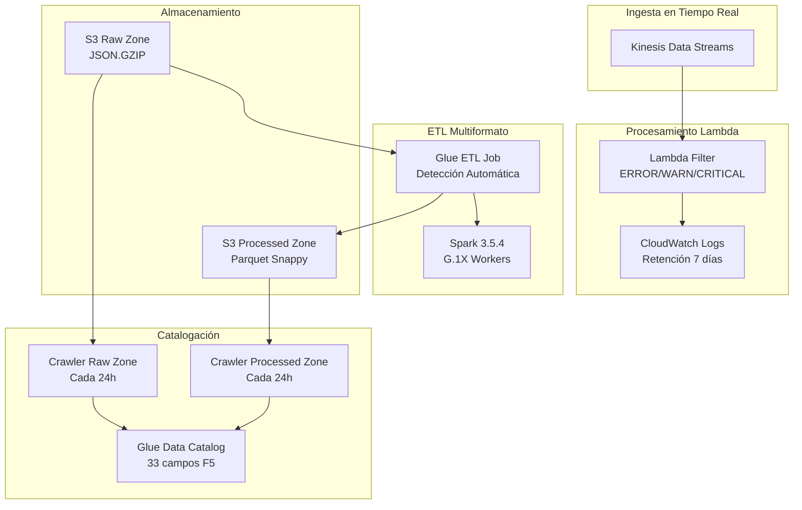
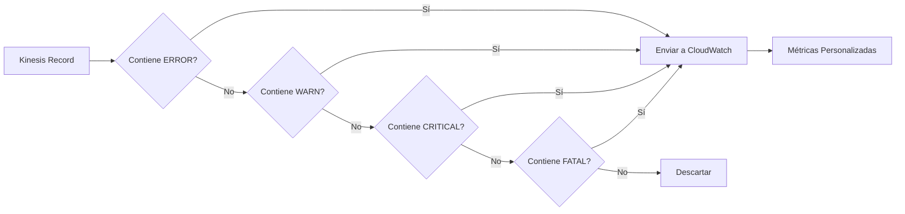
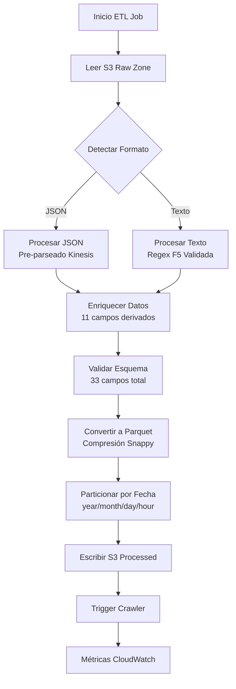
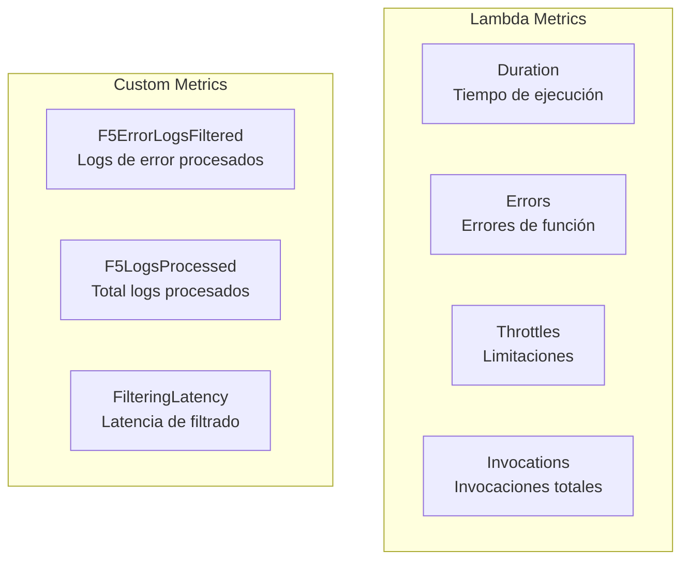
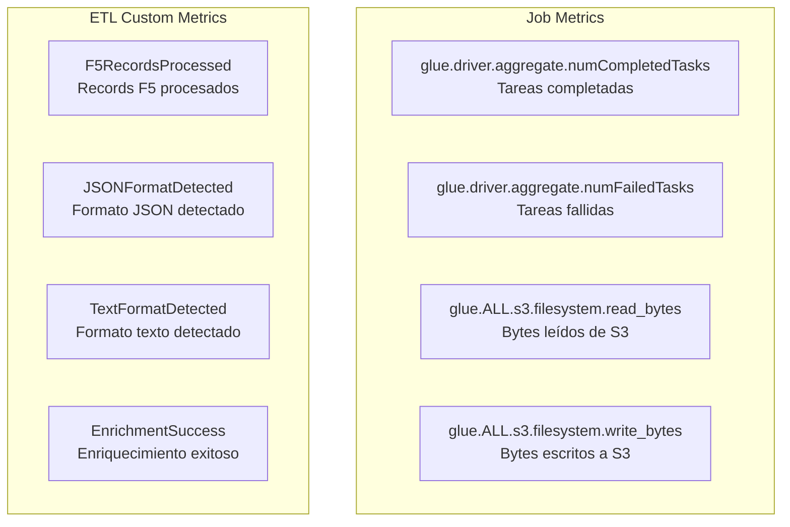

# Compute Stack - Infraestructura de Cómputo y ETL

## Descripción

El Compute Stack implementa la capa de procesamiento del Data Lake, incluyendo funciones Lambda para filtrado en tiempo real, jobs ETL multiformato con AWS Glue, y crawlers para catalogación automática. Es el núcleo del procesamiento de datos F5 con capacidades de detección automática de formato.

## Arquitectura de Procesamiento



## Componentes Principales

### Lambda Filter Function
- **Runtime**: Python 3.11
- **Memoria**: 256 MB
- **Timeout**: 5 minutos
- **Propósito**: Filtrado de logs ERROR/WARN/CRITICAL/FATAL en tiempo real

#### Configuración Técnica
```python
{
    "function_name": "agesic-dl-poc-log-filter",
    "runtime": "python3.11",
    "memory_size": 256,
    "timeout": 300,
    "environment": {
        "LOG_LEVEL": "INFO",
        "CLOUDWATCH_LOG_GROUP": "/aws/lambda/agesic-dl-poc-log-filter"
    }
}
```

#### Lógica de Filtrado


### AWS Glue ETL Multiformato
- **Nombre**: `agesic-dl-poc-f5-etl-multiformat`
- **Versión Glue**: 5.0 (Spark 3.5.4)
- **Worker Type**: G.1X (4 vCPU, 16 GB RAM)
- **Número de Workers**: 2-10 (auto-scaling)

#### Características del ETL Multiformato
```yaml
job_configuration:
  name: "agesic-dl-poc-f5-etl-multiformat"
  glue_version: "5.0"
  worker_type: "G.1X"
  number_of_workers: 2
  max_workers: 10
  timeout: 60
  max_retries: 1
  
capabilities:
  - deteccion_automatica_formato
  - procesamiento_json_kinesis
  - procesamiento_texto_regex_f5
  - enriquecimiento_33_campos
  - fallback_inteligente
  - metricas_personalizadas
```

#### Flujo ETL Multiformato


### Esquema de Datos F5 (33 campos)

#### Campos F5 Originales (22 campos)
```yaml
campos_f5_originales:
  - timestamp_syslog: string
  - hostname: string
  - ip_cliente_externo: string
  - ip_red_interna: string
  - usuario_autenticado: string
  - identidad: string
  - timestamp_apache: string
  - metodo: string
  - recurso: string
  - protocolo: string
  - codigo_respuesta: int
  - tamano_respuesta: int
  - referer: string
  - user_agent: string
  - tiempo_respuesta_ms: int
  - edad_cache: int
  - content_type: string
  - campo_reservado_1: string
  - campo_reservado_2: string
  - ambiente_origen: string
  - ambiente_pool: string
  - entorno_nodo: string
```

#### Campos Derivados para Analytics (11 campos)
```yaml
campos_derivados:
  - parsed_timestamp_syslog: timestamp
  - parsed_timestamp_apache: timestamp
  - is_error: boolean
  - status_category: string
  - is_slow: boolean
  - response_time_category: string
  - is_mobile: boolean
  - content_category: string
  - cache_hit: boolean
  - processing_timestamp: timestamp
  - etl_version: string
```

### Glue Crawlers
- **Raw Zone Crawler**: Descubre esquema de datos JSON originales
- **Processed Zone Crawler**: Descubre esquema Parquet con 33 campos
- **Frecuencia**: Cada 24 horas
- **Configuración**: Detección automática de esquema y particiones

#### Configuración de Crawlers
```json
{
  "raw_zone_crawler": {
    "name": "agesic-dl-poc-raw-crawler",
    "database": "agesic_dl_poc_database",
    "targets": ["s3://agesic-dl-poc-raw-zone/"],
    "schedule": "cron(0 2 * * ? *)",
    "schema_change_policy": "UPDATE_IN_DATABASE"
  },
  "processed_zone_crawler": {
    "name": "agesic-dl-poc-processed-crawler", 
    "database": "agesic_dl_poc_database",
    "targets": ["s3://agesic-dl-poc-processed-zone/f5-logs/"],
    "schedule": "cron(0 3 * * ? *)",
    "schema_change_policy": "UPDATE_IN_DATABASE"
  }
}
```

## Detección Automática de Formato

### Algoritmo de Detección
```python
def detect_format(record_content):
    """
    Detecta automáticamente el formato del log
    Returns: 'json' o 'text'
    """
    try:
        json.loads(record_content)
        return 'json'
    except json.JSONDecodeError:
        # Verificar patrones F5 típicos
        if re.match(r'^\w{3}\s+\d{1,2}\s+\d{2}:\d{2}:\d{2}', record_content):
            return 'text'
        return 'unknown'
```

### Procesamiento por Formato

#### Procesamiento JSON (Kinesis Agent)
```python
def process_json_format(json_record):
    """
    Procesa logs JSON pre-parseados por Kinesis Agent
    """
    parsed = json.loads(json_record)
    
    # Extraer campos F5 del JSON
    f5_fields = extract_f5_fields_from_json(parsed)
    
    # Enriquecer con campos derivados
    enriched = enrich_with_derived_fields(f5_fields)
    
    return enriched
```

#### Procesamiento Texto (Regex F5)
```python
def process_text_format(text_record):
    """
    Procesa logs de texto usando regex F5 validada
    """
    # Regex F5 validada al 100%
    f5_pattern = r'^(\w{3}\s+\d{1,2}\s+\d{2}:\d{2}:\d{2})\s+(\S+)\s+(\S+)\s+(\S+).*'
    
    match = re.match(f5_pattern, text_record)
    if match:
        f5_fields = parse_f5_regex_groups(match.groups())
        enriched = enrich_with_derived_fields(f5_fields)
        return enriched
    
    return None  # Fallback a formato desconocido
```

## Configuración de IAM y Permisos

### Rol IAM para Lambda
```json
{
  "Version": "2012-10-17",
  "Statement": [
    {
      "Effect": "Allow",
      "Action": [
        "kinesis:DescribeStream",
        "kinesis:GetShardIterator", 
        "kinesis:GetRecords",
        "kinesis:ListStreams"
      ],
      "Resource": "arn:aws:kinesis:*:*:stream/agesic-dl-poc-streaming"
    },
    {
      "Effect": "Allow",
      "Action": [
        "logs:CreateLogGroup",
        "logs:CreateLogStream",
        "logs:PutLogEvents"
      ],
      "Resource": "arn:aws:logs:*:*:*"
    },
    {
      "Effect": "Allow",
      "Action": [
        "cloudwatch:PutMetricData"
      ],
      "Resource": "*"
    }
  ]
}
```

### Rol IAM para Glue ETL
```json
{
  "Version": "2012-10-17",
  "Statement": [
    {
      "Effect": "Allow",
      "Action": [
        "s3:GetObject",
        "s3:PutObject",
        "s3:DeleteObject",
        "s3:ListBucket"
      ],
      "Resource": [
        "arn:aws:s3:::agesic-dl-poc-raw-zone",
        "arn:aws:s3:::agesic-dl-poc-raw-zone/*",
        "arn:aws:s3:::agesic-dl-poc-processed-zone",
        "arn:aws:s3:::agesic-dl-poc-processed-zone/*"
      ]
    },
    {
      "Effect": "Allow",
      "Action": [
        "glue:GetDatabase",
        "glue:GetTable",
        "glue:GetPartitions",
        "glue:CreateTable",
        "glue:UpdateTable",
        "glue:BatchCreatePartition"
      ],
      "Resource": "*"
    }
  ]
}
```

## Monitoreo y Métricas

### Métricas Lambda


### Métricas Glue ETL


### CloudWatch Alarms
```yaml
lambda_alarms:
  - name: "Lambda-F5-Error-Rate"
    metric: "Errors"
    threshold: 5
    period: 300
    evaluation_periods: 2
    
  - name: "Lambda-F5-Duration"
    metric: "Duration" 
    threshold: 30000  # 30 segundos
    period: 300
    evaluation_periods: 2

glue_alarms:
  - name: "Glue-ETL-Multiformat-Failures"
    metric: "glue.driver.aggregate.numFailedTasks"
    threshold: 1
    period: 300
    evaluation_periods: 1
```

## Configuración desde Assets

### Estructura de Assets
```
assets/compute-stack/
├── configurations/
│   └── glue-jobs-config.yaml
├── glue-scripts/
│   ├── etl_f5_multiformat.py
│   ├── etl_f5_to_parquet.py (legacy)
│   └── trigger_crawler.py
└── lambda/
    └── log_filter/
        ├── lambda_function.py
        └── requirements.txt
```

### Configuración Glue Jobs
```yaml
# glue-jobs-config.yaml
glue_jobs:
  f5_etl_multiformat:
    glue_version: "5.0"
    worker_type: "G.1X"
    number_of_workers: 2
    max_workers: 10
    timeout: 60
    max_retries: 1
    job_language: "python"
    
  f5_etl_legacy:
    glue_version: "4.0"
    worker_type: "G.1X" 
    number_of_workers: 2
    timeout: 30
    max_retries: 0
    job_language: "python"
```

## Dependencias

### Dependencias de Entrada
- **Network Stack**: VPC y security groups para Lambda y Glue
- **Storage Stack**: Buckets raw y processed para ETL
- **Streaming Stack**: Kinesis stream para Lambda trigger

### Stacks que Dependen de Compute Stack
- **Analytics Stack**: Utiliza tablas catalogadas por crawlers
- **Monitoring Stack**: Utiliza métricas generadas por Lambda y Glue

### Recursos Exportados
- **lambda_function**: Referencia a función Lambda de filtrado
- **etl_job**: Referencia a job ETL multiformato
- **glue_database**: Referencia a base de datos Glue

## Troubleshooting Común

### Problemas Lambda
```bash
# Verificar logs de Lambda
aws logs describe-log-streams \
  --log-group-name /aws/lambda/agesic-dl-poc-log-filter \
  --order-by LastEventTime \
  --descending

# Verificar métricas de error
aws cloudwatch get-metric-statistics \
  --namespace AWS/Lambda \
  --metric-name Errors \
  --dimensions Name=FunctionName,Value=agesic-dl-poc-log-filter \
  --start-time 2024-08-21T12:00:00Z \
  --end-time 2024-08-21T13:00:00Z \
  --period 300 \
  --statistics Sum
```

### Problemas Glue ETL
```bash
# Verificar estado del job
aws glue get-job-run \
  --job-name agesic-dl-poc-f5-etl-multiformat \
  --run-id jr_xxx

# Verificar logs del job
aws logs describe-log-streams \
  --log-group-name /aws-glue/jobs/agesic-dl-poc-f5-etl-multiformat \
  --order-by LastEventTime \
  --descending
```

### Problemas de Crawlers
```bash
# Verificar estado del crawler
aws glue get-crawler \
  --name agesic-dl-poc-processed-crawler

# Verificar tablas creadas
aws glue get-tables \
  --database-name agesic_dl_poc_database
```

## Estimación de Costos

### Costos Mensuales Estimados
```
AWS Lambda:
- Invocaciones: 1M requests/mes = $0.20
- Duración: 256MB x 1s x 1M = $1.67
- Total Lambda: ~$2.00/mes

AWS Glue ETL:
- DPU-Hour: G.1X x 2 workers x 1h/día = $0.44/día
- Total mensual: ~$13.20/mes
- Jobs adicionales: ~$2.00/mes
- Total Glue: ~$15.20/mes

AWS Glue Crawlers:
- Crawler runs: 2 crawlers x 1 run/día = $0.44/mes

Total Compute Stack: ~$17.64/mes
```

### Optimizaciones de Costo
1. **Auto-scaling Glue**: Workers ajustados según carga
2. **Lambda Right-sizing**: 256MB óptimo para filtrado
3. **Crawler Schedule**: Solo 1 vez por día
4. **Spot Instances**: Para jobs ETL no críticos (futuro)
