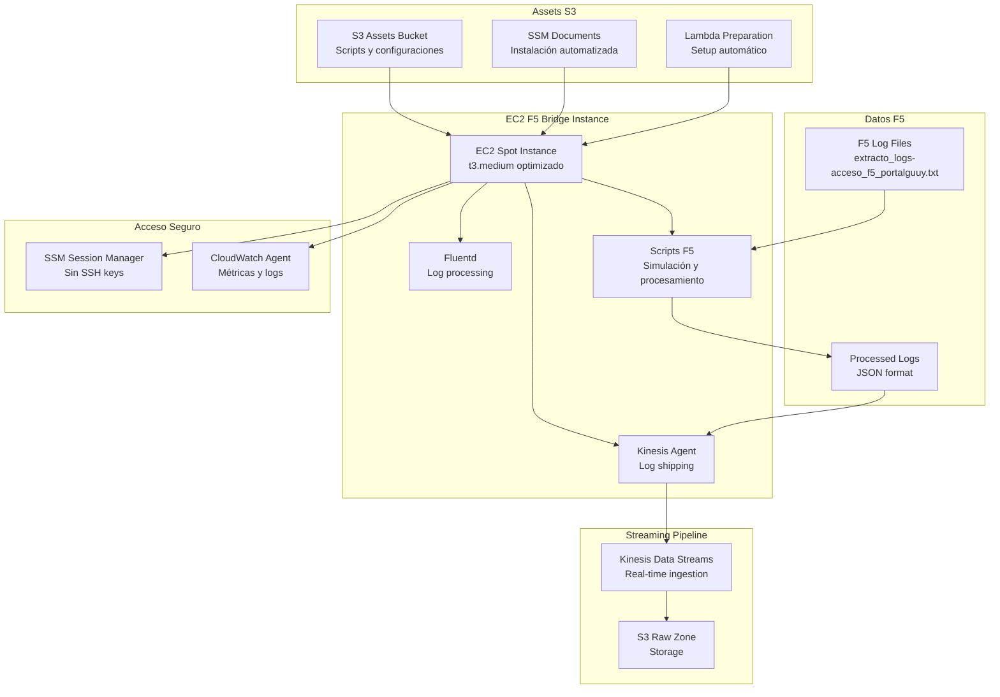

# EC2 Stack Enhanced - F5 Bridge con Assets

## Descripción

El EC2 Stack Enhanced implementa la infraestructura de simulación y bridge para logs F5, utilizando instancias EC2 Spot con dual agents (Kinesis Agent + Fluentd), SSM Session Manager para acceso seguro, y assets externos para configuración y scripts. Proporciona la capacidad de simular y procesar logs F5 reales.

## Arquitectura F5 Bridge



## Componentes Principales

### EC2 Spot Instance
- **Tipo**: t3.medium (2 vCPU, 4 GB RAM)
- **AMI**: Amazon Linux 2023
- **Pricing**: Spot instances para optimización de costos
- **Auto Scaling**: Grupo con 1 instancia mínima

#### Configuración de Instancia
```yaml
instance_configuration:
  instance_type: "t3.medium"
  ami: "Amazon Linux 2023"
  spot_price: "0.0416"  # ~70% descuento vs OnDemand
  
  user_data:
    - install_ssm_agent
    - install_cloudwatch_agent
    - download_assets_from_s3
    - execute_ssm_documents
    
  tags:
    Name: "agesic-dl-poc-f5-bridge"
    Environment: "PoC"
    Purpose: "F5 Log Processing Bridge"
```

### Dual Agent Configuration

#### Kinesis Agent
```json
{
  "cloudwatch.emitMetrics": true,
  "kinesis.endpoint": "https://kinesis.us-east-2.amazonaws.com",
  "flows": [
    {
      "filePattern": "/opt/agesic-datalake/processed_logs/*.json",
      "kinesisStream": "agesic-dl-poc-streaming",
      "partitionKeyOption": "RANDOM",
      "dataProcessingOptions": [
        {
          "optionName": "LOGTOJSON",
          "logFormat": "COMMONAPACHELOG"
        }
      ]
    }
  ]
}
```

#### Fluentd Configuration
```ruby
<source>
  @type tail
  path /opt/agesic-datalake/raw_logs/*.log
  pos_file /var/log/fluentd/f5_logs.log.pos
  tag f5.access
  format apache2
  refresh_interval 5
</source>

<match f5.access>
  @type kinesis_streams
  region us-east-2
  stream_name agesic-dl-poc-streaming
  partition_key_expr record['host']
  
  <buffer>
    @type file
    path /var/log/fluentd/buffer/kinesis
    flush_interval 10s
    chunk_limit_size 1m
  </buffer>
</match>
```

## Assets Externos

### Estructura de Assets
```
assets/ec2-stack/
├── lambda/
│   └── ec2_preparation_function.py
├── scripts/
│   ├── download_and_process.sh
│   ├── f5_log_processor.py
│   ├── status.sh
│   └── install_agents.sh
└── ssm-documents/
    ├── install_kinesis_agent.yaml
    ├── install_fluentd.yaml
    ├── configure_cloudwatch_agent.yaml
    └── setup_f5_environment.yaml
```

### Lambda Preparation Function
```python
import boto3
import json

def lambda_handler(event, context):
    """
    Función Lambda para preparar instancia EC2 F5 Bridge
    """
    ec2 = boto3.client('ec2')
    ssm = boto3.client('ssm')
    
    instance_id = event['instance_id']
    
    # Ejecutar SSM Documents en secuencia
    documents = [
        'agesic-dl-poc-install-kinesis-agent',
        'agesic-dl-poc-install-fluentd', 
        'agesic-dl-poc-configure-cloudwatch-agent',
        'agesic-dl-poc-setup-f5-environment'
    ]
    
    for document in documents:
        response = ssm.send_command(
            InstanceIds=[instance_id],
            DocumentName=document,
            Parameters={
                'executionTimeout': ['3600']
            }
        )
        
    return {
        'statusCode': 200,
        'body': json.dumps(f'Setup initiated for {instance_id}')
    }
```

### SSM Documents

#### Install Kinesis Agent Document
```yaml
schemaVersion: "2.2"
description: "Instala y configura Kinesis Agent para logs F5"
parameters:
  executionTimeout:
    type: "String"
    default: "3600"
    
mainSteps:
  - action: "aws:runShellScript"
    name: "installKinesisAgent"
    inputs:
      timeoutSeconds: "{{ executionTimeout }}"
      runCommand:
        - "#!/bin/bash"
        - "yum update -y"
        - "yum install -y aws-kinesis-agent"
        - "aws s3 cp s3://agesic-dl-poc-assets/kinesis-agent/agent.json /etc/aws-kinesis/agent.json"
        - "systemctl enable aws-kinesis-agent"
        - "systemctl start aws-kinesis-agent"
        - "systemctl status aws-kinesis-agent"
```

#### Setup F5 Environment Document
```yaml
schemaVersion: "2.2"
description: "Configura entorno F5 con scripts de procesamiento"
parameters:
  executionTimeout:
    type: "String"
    default: "3600"
    
mainSteps:
  - action: "aws:runShellScript"
    name: "setupF5Environment"
    inputs:
      timeoutSeconds: "{{ executionTimeout }}"
      runCommand:
        - "#!/bin/bash"
        - "mkdir -p /opt/agesic-datalake/{raw_logs,processed_logs,scripts}"
        - "aws s3 sync s3://agesic-dl-poc-assets/scripts/ /opt/agesic-datalake/scripts/"
        - "chmod +x /opt/agesic-datalake/scripts/*.sh"
        - "python3 -m pip install boto3 pandas regex"
        - "cd /opt/agesic-datalake && ./scripts/status.sh"
```

## Scripts F5 de Procesamiento

### F5 Log Processor (Python)
```python
#!/usr/bin/env python3
"""
F5 Log Processor - Procesa logs F5 y los convierte a JSON
"""
import re
import json
import sys
from datetime import datetime
import boto3

class F5LogProcessor:
    def __init__(self):
        self.f5_regex = re.compile(
            r'^(\w{3}\s+\d{1,2}\s+\d{2}:\d{2}:\d{2})\s+'  # timestamp_syslog
            r'(\S+)\s+'                                     # hostname
            r'(\S+)\s+'                                     # ip_cliente_externo
            r'(\S+)\s+'                                     # ip_red_interna
            r'(\S+)\s+'                                     # usuario_autenticado
            r'(\S+)\s+'                                     # identidad
            r'\[([^\]]+)\]\s+'                             # timestamp_apache
            r'"(\S+)\s+([^"]+)\s+([^"]+)"\s+'              # metodo, recurso, protocolo
            r'(\d+)\s+'                                     # codigo_respuesta
            r'(\d+)\s+'                                     # tamano_respuesta
            r'"([^"]*)"\s+'                                # referer
            r'"([^"]*)"\s+'                                # user_agent
            r'(\d+)\s+'                                     # tiempo_respuesta_ms
            r'(\d+)\s+'                                     # edad_cache
            r'"([^"]*)"\s+'                                # content_type
            r'(\S+)\s+'                                     # campo_reservado_1
            r'(\S+)\s+'                                     # campo_reservado_2
            r'(\S+)\s+'                                     # ambiente_origen
            r'(\S+)\s+'                                     # ambiente_pool
            r'(\S+)'                                        # entorno_nodo
        )
        
    def process_log_line(self, line):
        """Procesa una línea de log F5 y retorna JSON"""
        match = self.f5_regex.match(line.strip())
        if not match:
            return None
            
        groups = match.groups()
        
        # Mapear campos F5
        f5_record = {
            'timestamp_syslog': groups[0],
            'hostname': groups[1],
            'ip_cliente_externo': groups[2],
            'ip_red_interna': groups[3],
            'usuario_autenticado': groups[4],
            'identidad': groups[5],
            'timestamp_apache': groups[6],
            'metodo': groups[7],
            'recurso': groups[8],
            'protocolo': groups[9],
            'codigo_respuesta': int(groups[10]),
            'tamano_respuesta': int(groups[11]),
            'referer': groups[12],
            'user_agent': groups[13],
            'tiempo_respuesta_ms': int(groups[14]),
            'edad_cache': int(groups[15]),
            'content_type': groups[16],
            'campo_reservado_1': groups[17],
            'campo_reservado_2': groups[18],
            'ambiente_origen': groups[19],
            'ambiente_pool': groups[20],
            'entorno_nodo': groups[21]
        }
        
        # Agregar campos derivados
        f5_record.update(self._add_derived_fields(f5_record))
        
        return f5_record
    
    def _add_derived_fields(self, record):
        """Agrega campos derivados para analytics"""
        return {
            'is_error': record['codigo_respuesta'] >= 400,
            'is_slow': record['tiempo_respuesta_ms'] > 1000,
            'is_mobile': 'Mobile' in record['user_agent'],
            'cache_hit': record['edad_cache'] > 0,
            'processing_timestamp': datetime.utcnow().isoformat(),
            'etl_version': '2.0'
        }

if __name__ == "__main__":
    processor = F5LogProcessor()
    
    # Procesar archivo de logs F5
    input_file = "/opt/agesic-datalake/raw_logs/extracto_logs-acceso_f5_portalguuy.txt"
    output_file = "/opt/agesic-datalake/processed_logs/f5_logs.json"
    
    processed_count = 0
    
    with open(input_file, 'r') as infile, open(output_file, 'w') as outfile:
        for line in infile:
            json_record = processor.process_log_line(line)
            if json_record:
                outfile.write(json.dumps(json_record) + '\n')
                processed_count += 1
    
    print(f"Procesados {processed_count} registros F5")
```

### Download and Process Script
```bash
#!/bin/bash
# download_and_process.sh - Descarga y procesa logs F5

set -e

WORK_DIR="/opt/agesic-datalake"
RAW_DIR="$WORK_DIR/raw_logs"
PROCESSED_DIR="$WORK_DIR/processed_logs"
SCRIPTS_DIR="$WORK_DIR/scripts"

echo "=== AGESIC Data Lake F5 Bridge ==="
echo "Iniciando descarga y procesamiento de logs F5..."

# Crear directorios si no existen
mkdir -p "$RAW_DIR" "$PROCESSED_DIR"

# Descargar logs F5 desde S3
echo "Descargando logs F5 desde S3..."
aws s3 cp s3://agesic-dl-poc-assets/sample-data/extracto_logs-acceso_f5_portalguuy.txt "$RAW_DIR/"

# Verificar descarga
if [ ! -f "$RAW_DIR/extracto_logs-acceso_f5_portalguuy.txt" ]; then
    echo "ERROR: No se pudo descargar el archivo de logs F5"
    exit 1
fi

# Procesar logs con Python
echo "Procesando logs F5 con regex validada..."
cd "$WORK_DIR"
python3 "$SCRIPTS_DIR/f5_log_processor.py"

# Verificar procesamiento
if [ ! -f "$PROCESSED_DIR/f5_logs.json" ]; then
    echo "ERROR: No se pudo procesar los logs F5"
    exit 1
fi

# Mostrar estadísticas
echo "=== Estadísticas de Procesamiento ==="
echo "Líneas originales: $(wc -l < "$RAW_DIR/extracto_logs-acceso_f5_portalguuy.txt")"
echo "Registros JSON procesados: $(wc -l < "$PROCESSED_DIR/f5_logs.json")"
echo "Tamaño archivo original: $(du -h "$RAW_DIR/extracto_logs-acceso_f5_portalguuy.txt" | cut -f1)"
echo "Tamaño archivo procesado: $(du -h "$PROCESSED_DIR/f5_logs.json" | cut -f1)"

# Iniciar Kinesis Agent si no está corriendo
if ! systemctl is-active --quiet aws-kinesis-agent; then
    echo "Iniciando Kinesis Agent..."
    sudo systemctl start aws-kinesis-agent
fi

echo "=== Procesamiento Completado ==="
echo "Los logs están siendo enviados a Kinesis Data Streams"
echo "Monitorear con: sudo tail -f /var/log/aws-kinesis-agent/aws-kinesis-agent.log"
```

### Status Script
```bash
#!/bin/bash
# status.sh - Muestra estado del sistema F5 Bridge

echo "=== AGESIC Data Lake F5 Bridge Status ==="
echo

# Estado de servicios
echo "--- Servicios ---"
echo "Kinesis Agent: $(systemctl is-active aws-kinesis-agent 2>/dev/null || echo 'not installed')"
echo "Fluentd: $(systemctl is-active fluentd 2>/dev/null || echo 'not installed')"
echo "CloudWatch Agent: $(systemctl is-active amazon-cloudwatch-agent 2>/dev/null || echo 'not installed')"
echo

# Estado de archivos
echo "--- Archivos F5 ---"
RAW_DIR="/opt/agesic-datalake/raw_logs"
PROCESSED_DIR="/opt/agesic-datalake/processed_logs"

if [ -d "$RAW_DIR" ]; then
    echo "Logs raw: $(ls -la "$RAW_DIR" 2>/dev/null | wc -l) archivos"
else
    echo "Logs raw: directorio no existe"
fi

if [ -d "$PROCESSED_DIR" ]; then
    echo "Logs procesados: $(ls -la "$PROCESSED_DIR" 2>/dev/null | wc -l) archivos"
else
    echo "Logs procesados: directorio no existe"
fi

# Métricas de sistema
echo
echo "--- Sistema ---"
echo "CPU: $(top -bn1 | grep "Cpu(s)" | awk '{print $2}' | cut -d'%' -f1)% usado"
echo "Memoria: $(free -m | awk 'NR==2{printf "%.1f%%", $3*100/$2}')"
echo "Disco: $(df -h / | awk 'NR==2{print $5}')"

# Conectividad AWS
echo
echo "--- Conectividad AWS ---"
if aws sts get-caller-identity >/dev/null 2>&1; then
    echo "AWS CLI: ✓ Conectado"
    echo "Región: $(aws configure get region)"
else
    echo "AWS CLI: ✗ Error de conexión"
fi

echo
echo "=== Fin del Status ==="
```

## Configuración de IAM y Permisos

### Rol IAM para EC2
```json
{
  "Version": "2012-10-17",
  "Statement": [
    {
      "Effect": "Allow",
      "Action": [
        "kinesis:PutRecord",
        "kinesis:PutRecords",
        "kinesis:DescribeStream"
      ],
      "Resource": "arn:aws:kinesis:*:*:stream/agesic-dl-poc-streaming"
    },
    {
      "Effect": "Allow",
      "Action": [
        "s3:GetObject",
        "s3:ListBucket"
      ],
      "Resource": [
        "arn:aws:s3:::agesic-dl-poc-assets",
        "arn:aws:s3:::agesic-dl-poc-assets/*",
        "arn:aws:s3:::agesic-dl-poc-raw-zone",
        "arn:aws:s3:::agesic-dl-poc-raw-zone/*"
      ]
    },
    {
      "Effect": "Allow",
      "Action": [
        "ssm:UpdateInstanceInformation",
        "ssm:SendCommand",
        "ssm:ListCommands",
        "ssm:ListCommandInvocations",
        "ssm:DescribeInstanceInformation",
        "ssm:GetCommandInvocation"
      ],
      "Resource": "*"
    },
    {
      "Effect": "Allow",
      "Action": [
        "cloudwatch:PutMetricData",
        "logs:CreateLogGroup",
        "logs:CreateLogStream",
        "logs:PutLogEvents"
      ],
      "Resource": "*"
    }
  ]
}
```

## Auto Scaling y Spot Instances

### Configuración Auto Scaling Group
```yaml
auto_scaling_group:
  name: "agesic-dl-poc-f5-bridge-asg"
  min_size: 1
  max_size: 2
  desired_capacity: 1
  
  launch_template:
    instance_type: "t3.medium"
    spot_allocation_strategy: "diversified"
    spot_instance_pools: 2
    
  health_check:
    type: "EC2"
    grace_period: 300
    
  tags:
    - key: "Name"
      value: "agesic-dl-poc-f5-bridge"
      propagate_at_launch: true
```

### Spot Instance Configuration
```json
{
  "spot_fleet_request_config": {
    "target_capacity": 1,
    "allocation_strategy": "lowestPrice",
    "instance_interruption_behavior": "terminate",
    "replace_unhealthy_instances": true,
    
    "launch_template_configs": [
      {
        "launch_template_specification": {
          "launch_template_name": "agesic-dl-poc-f5-bridge-template",
          "version": "$Latest"
        },
        "overrides": [
          {
            "instance_type": "t3.medium",
            "spot_price": "0.0416",
            "subnet_id": "subnet-xxx"
          }
        ]
      }
    ]
  }
}
```

## Monitoreo y Logs

### CloudWatch Agent Configuration
```json
{
  "agent": {
    "metrics_collection_interval": 60,
    "run_as_user": "cwagent"
  },
  "metrics": {
    "namespace": "AGESIC-DL-POC/EC2",
    "metrics_collected": {
      "cpu": {
        "measurement": ["cpu_usage_idle", "cpu_usage_iowait", "cpu_usage_user", "cpu_usage_system"],
        "metrics_collection_interval": 60
      },
      "disk": {
        "measurement": ["used_percent"],
        "metrics_collection_interval": 60,
        "resources": ["*"]
      },
      "mem": {
        "measurement": ["mem_used_percent"],
        "metrics_collection_interval": 60
      }
    }
  },
  "logs": {
    "logs_collected": {
      "files": {
        "collect_list": [
          {
            "file_path": "/var/log/aws-kinesis-agent/aws-kinesis-agent.log",
            "log_group_name": "/aws/ec2/agesic-dl-poc-f5-bridge",
            "log_stream_name": "kinesis-agent"
          },
          {
            "file_path": "/opt/agesic-datalake/logs/processing.log",
            "log_group_name": "/aws/ec2/agesic-dl-poc-f5-bridge", 
            "log_stream_name": "f5-processing"
          }
        ]
      }
    }
  }
}
```

## Dependencias

### Dependencias de Entrada
- **Network Stack**: VPC y security groups para EC2
- **Streaming Stack**: Kinesis stream para envío de logs
- **Storage Stack**: Bucket raw para almacenar assets

### Stacks que Dependen de EC2 Stack Enhanced
- Ninguno (stack independiente de simulación)

### Recursos Exportados
- **instance_id**: ID de la instancia EC2 creada
- **auto_scaling_group_name**: Nombre del ASG
- **security_group_id**: ID del security group EC2

## Estimación de Costos

### Costos EC2 Spot (mensual)
```
EC2 Spot Instance (t3.medium):
- Precio OnDemand: $0.0416/hora
- Precio Spot (promedio): $0.0125/hora (~70% descuento)
- Costo mensual: $0.0125 x 24 x 30 = $9.00

EBS Storage:
- 20GB gp3: $1.60/mes

Data Transfer:
- Kinesis ingestion: Incluido en Kinesis pricing
- S3 uploads: Mínimo

CloudWatch Agent:
- Métricas: Incluidas en CloudWatch pricing
- Logs: ~$0.50/mes

Total EC2 Stack: ~$11.10/mes
```

### Optimizaciones de Costo
1. **Spot Instances**: 70% descuento vs OnDemand
2. **Auto Scaling**: Escala a 0 cuando no se necesita
3. **EBS Optimizado**: gp3 más eficiente que gp2
4. **Logs Retention**: 7 días para reducir costos

## Troubleshooting Común

### Problemas de Spot Instances
```bash
# Verificar estado de Spot Request
aws ec2 describe-spot-instance-requests \
  --filters "Name=state,Values=active"

# Verificar interrupciones
aws ec2 describe-spot-price-history \
  --instance-types t3.medium \
  --product-descriptions "Linux/UNIX" \
  --max-items 10
```

### Problemas de Kinesis Agent
```bash
# Verificar logs de Kinesis Agent
sudo tail -f /var/log/aws-kinesis-agent/aws-kinesis-agent.log

# Verificar configuración
sudo cat /etc/aws-kinesis/agent.json

# Reiniciar servicio
sudo systemctl restart aws-kinesis-agent
sudo systemctl status aws-kinesis-agent
```

### Problemas de SSM
```bash
# Verificar conectividad SSM
aws ssm describe-instance-information \
  --filters "Key=InstanceIds,Values=i-1234567890abcdef0"

# Ejecutar comando de prueba
aws ssm send-command \
  --instance-ids "i-1234567890abcdef0" \
  --document-name "AWS-RunShellScript" \
  --parameters 'commands=["echo Hello World"]'
```

### Acceso via SSM Session Manager
```bash
# Conectar a instancia
aws ssm start-session --target i-1234567890abcdef0

# Una vez conectado, verificar estado
cd /opt/agesic-datalake
./scripts/status.sh

# Procesar logs manualmente
./scripts/download_and_process.sh
```
