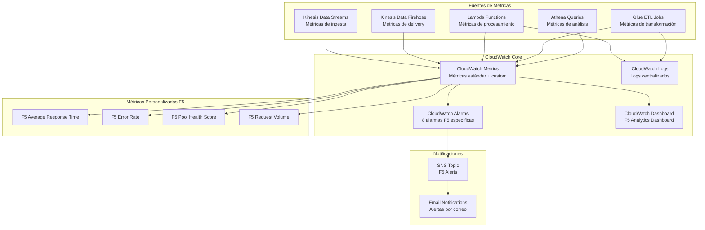
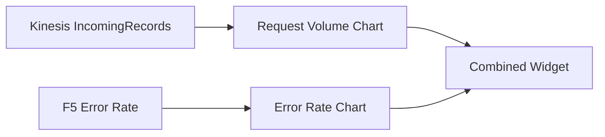
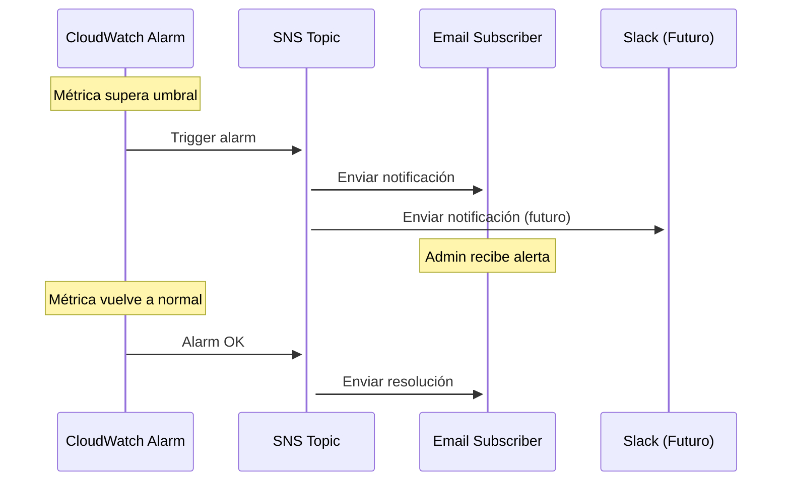

# Monitoring Stack - Infraestructura de Monitoreo

## Descripción

El Monitoring Stack implementa un sistema completo de monitoreo y alertas para el Data Lake F5, incluyendo métricas personalizadas de CloudWatch, alarmas específicas para componentes críticos, dashboard analytics y notificaciones SNS. Proporciona visibilidad operacional completa del pipeline de datos.

## Arquitectura de Monitoreo



## Componentes Principales

### SNS Topic para Alertas F5
- **Nombre**: `agesic-dl-poc-f5-alerts`
- **Propósito**: Canal centralizado para todas las alertas F5
- **Suscripciones**: Email configurado desde cdk.json

#### Configuración SNS
```json
{
  "topic_name": "agesic-dl-poc-f5-alerts",
  "display_name": "Alertas de análisis F5 AGESIC",
  "subscriptions": [
    {
      "protocol": "email",
      "endpoint": "admin@agesic.gub.uy"
    }
  ]
}
```

### CloudWatch Alarms (8 alarmas específicas F5)

#### 1. Kinesis No Incoming Records
```yaml
alarm_name: "Kinesis-No-Incoming-Records"
description: "Sin datos F5 por más de 10 minutos"
metric_name: "IncomingRecords"
namespace: "AWS/Kinesis"
statistic: "Sum"
period: 300
evaluation_periods: 2
threshold: 1
comparison_operator: "LessThanThreshold"
treat_missing_data: "breaching"
```

#### 2. Kinesis High Iterator Age
```yaml
alarm_name: "Kinesis-High-Iterator-Age"
description: "Lag de procesamiento F5 alto"
metric_name: "GetRecords.IteratorAgeMilliseconds"
namespace: "AWS/Kinesis"
statistic: "Maximum"
period: 300
evaluation_periods: 2
threshold: 300000  # 5 minutos
comparison_operator: "GreaterThanThreshold"
```

#### 3. Lambda F5 Error Rate
```yaml
alarm_name: "Lambda-F5-Error-Rate"
description: "Errores en procesamiento Lambda F5"
metric_name: "Errors"
namespace: "AWS/Lambda"
statistic: "Sum"
period: 300
evaluation_periods: 2
threshold: 5
comparison_operator: "GreaterThanThreshold"
```

#### 4. Lambda F5 Duration
```yaml
alarm_name: "Lambda-F5-Duration"
description: "Duración alta de procesamiento Lambda F5"
metric_name: "Duration"
namespace: "AWS/Lambda"
statistic: "Average"
period: 300
evaluation_periods: 2
threshold: 30000  # 30 segundos
comparison_operator: "GreaterThanThreshold"
```

#### 5. Glue ETL Multiformat Failures
```yaml
alarm_name: "Glue-ETL-Multiformat-Failures"
description: "Fallos en ETL multiformato"
metric_name: "glue.driver.aggregate.numFailedTasks"
namespace: "AWS/Glue"
statistic: "Sum"
period: 300
evaluation_periods: 1
threshold: 1
comparison_operator: "GreaterThanOrEqualToThreshold"
```

#### 6. F5 Average Response Time
```yaml
alarm_name: "F5-Average-Response-Time"
description: "Tiempo de respuesta F5 alto"
metric_name: "F5AverageResponseTime"
namespace: "AGESIC-DL-POC/F5Analytics"
statistic: "Average"
period: 300
evaluation_periods: 3
threshold: 2000  # 2 segundos
comparison_operator: "GreaterThanThreshold"
```

#### 7. F5 Error Rate
```yaml
alarm_name: "F5-Error-Rate"
description: "Tasa de errores F5 alta"
metric_name: "F5ErrorRate"
namespace: "AGESIC-DL-POC/F5Analytics"
statistic: "Average"
period: 300
evaluation_periods: 2
threshold: 5.0  # 5%
comparison_operator: "GreaterThanThreshold"
```

#### 8. F5 Pool Health Score
```yaml
alarm_name: "F5-Pool-Health-Score"
description: "Score de salud de pools F5 bajo"
metric_name: "F5PoolHealthScore"
namespace: "AGESIC-DL-POC/F5Analytics"
statistic: "Average"
period: 600
evaluation_periods: 2
threshold: 70.0  # Score mínimo 70
comparison_operator: "LessThanThreshold"
```

## CloudWatch Dashboard F5 Analytics

### Configuración del Dashboard
```json
{
  "dashboard_name": "agesic-dl-poc-f5-analytics-dashboard",
  "dashboard_body": {
    "widgets": [
      {
        "type": "metric",
        "properties": {
          "metrics": [
            ["AWS/Kinesis", "IncomingRecords", "StreamName", "agesic-dl-poc-streaming"],
            ["AGESIC-DL-POC/F5Analytics", "F5ErrorRate"]
          ],
          "period": 300,
          "stat": "Average",
          "region": "us-east-2",
          "title": "Request Volume & Error Rate",
          "yAxis": {
            "left": {"min": 0}
          }
        }
      }
    ]
  }
}
```

### Widgets del Dashboard

#### 1. Request Volume & Error Rate


#### 2. Response Time Metrics
```json
{
  "type": "metric",
  "properties": {
    "metrics": [
      ["AGESIC-DL-POC/F5Analytics", "F5AverageResponseTime", {"stat": "Average"}],
      ["AGESIC-DL-POC/F5Analytics", "F5P95ResponseTime", {"stat": "Average"}]
    ],
    "title": "Response Time Metrics (Avg, P95)",
    "period": 300,
    "yAxis": {"left": {"label": "Milliseconds"}}
  }
}
```

#### 3. Pool Health Score
```json
{
  "type": "metric",
  "properties": {
    "metrics": [
      ["AGESIC-DL-POC/F5Analytics", "F5PoolHealthScore"]
    ],
    "title": "Pool Health Score (0-100)",
    "period": 300,
    "yAxis": {"left": {"min": 0, "max": 100}}
  }
}
```

#### 4. Processing Pipeline Health
```json
{
  "type": "metric",
  "properties": {
    "metrics": [
      ["AWS/Lambda", "Duration", "FunctionName", "agesic-dl-poc-log-filter"],
      ["AWS/Glue", "glue.driver.aggregate.numCompletedTasks", "JobName", "agesic-dl-poc-f5-etl-multiformat"],
      ["AWS/KinesisFirehose", "DeliveryToS3.Success", "DeliveryStreamName", "agesic-dl-poc-delivery"]
    ],
    "title": "Processing Pipeline Health"
  }
}
```

#### 5. Traffic Distribution
```json
{
  "type": "metric",
  "properties": {
    "metrics": [
      ["AGESIC-DL-POC/F5Analytics", "F5MobileTrafficPercentage"],
      ["AGESIC-DL-POC/F5Analytics", "F5CacheHitRate"]
    ],
    "title": "Traffic Distribution (Mobile & Cache)"
  }
}
```

## Métricas Personalizadas F5

### Namespace: AGESIC-DL-POC/F5Analytics

#### Métricas de Performance
```python
# Ejemplo de envío de métricas personalizadas desde Lambda
import boto3

cloudwatch = boto3.client('cloudwatch')

def put_f5_metrics(avg_response_time, error_rate, pool_health_score):
    cloudwatch.put_metric_data(
        Namespace='AGESIC-DL-POC/F5Analytics',
        MetricData=[
            {
                'MetricName': 'F5AverageResponseTime',
                'Value': avg_response_time,
                'Unit': 'Milliseconds',
                'Dimensions': [
                    {
                        'Name': 'Environment',
                        'Value': 'Production'
                    }
                ]
            },
            {
                'MetricName': 'F5ErrorRate',
                'Value': error_rate,
                'Unit': 'Percent'
            },
            {
                'MetricName': 'F5PoolHealthScore',
                'Value': pool_health_score,
                'Unit': 'Count'
            }
        ]
    )
```

#### Métricas de Tráfico
```python
def put_traffic_metrics(mobile_percentage, cache_hit_rate, request_volume):
    cloudwatch.put_metric_data(
        Namespace='AGESIC-DL-POC/F5Analytics',
        MetricData=[
            {
                'MetricName': 'F5MobileTrafficPercentage',
                'Value': mobile_percentage,
                'Unit': 'Percent'
            },
            {
                'MetricName': 'F5CacheHitRate',
                'Value': cache_hit_rate,
                'Unit': 'Percent'
            },
            {
                'MetricName': 'F5RequestVolume',
                'Value': request_volume,
                'Unit': 'Count/Second'
            }
        ]
    )
```

## Flujo de Alertas



### Formato de Notificaciones
```json
{
  "AlarmName": "F5-Average-Response-Time",
  "AlarmDescription": "Tiempo de respuesta F5 alto",
  "AWSAccountId": "123456789012",
  "NewStateValue": "ALARM",
  "NewStateReason": "Threshold Crossed: 1 out of the last 1 datapoints [2500.0 (21/08/24 13:45:00)] was greater than the threshold (2000.0).",
  "StateChangeTime": "2024-08-21T13:45:00.000+0000",
  "Region": "US East (Ohio)",
  "AlarmArn": "arn:aws:cloudwatch:us-east-2:123456789012:alarm:F5-Average-Response-Time",
  "OldStateValue": "OK",
  "Trigger": {
    "MetricName": "F5AverageResponseTime",
    "Namespace": "AGESIC-DL-POC/F5Analytics",
    "StatisticType": "Statistic",
    "Statistic": "AVERAGE",
    "Unit": null,
    "Dimensions": [],
    "Period": 300,
    "EvaluationPeriods": 3,
    "ComparisonOperator": "GreaterThanThreshold",
    "Threshold": 2000.0,
    "TreatMissingData": "- TreatMissingData: notBreaching"
  }
}
```

## Logs Centralizados

### Grupos de Logs Configurados
```yaml
log_groups:
  - name: "/aws/lambda/agesic-dl-poc-log-filter"
    retention_days: 7
    
  - name: "/aws-glue/jobs/agesic-dl-poc-f5-etl-multiformat"
    retention_days: 14
    
  - name: "/aws/kinesisfirehose/agesic-dl-poc-delivery"
    retention_days: 7
    
  - name: "/aws/athena/agesic-dl-poc-f5-analytics-wg"
    retention_days: 30
```

### Filtros de Logs para Alertas
```python
# Filtro para errores críticos en Lambda
ERROR_FILTER = '[timestamp, request_id, level="ERROR", message]'

# Filtro para fallos de ETL en Glue
ETL_FAILURE_FILTER = '[timestamp, job_id, level="ERROR", message="*FAILED*"]'

# Filtro para errores de delivery en Firehose
DELIVERY_ERROR_FILTER = '[timestamp, delivery_stream, error_code, message]'
```

## Configuración desde cdk.json

```json
{
  "notifications": {
    "email": "admin@agesic.gub.uy",
    "slack_webhook": null
  },
  "cloudwatch": {
    "log_retention_days": 7,
    "dashboard_refresh_interval": 300,
    "alarm_evaluation_periods": 2
  },
  "monitoring": {
    "enable_detailed_monitoring": true,
    "custom_metrics_namespace": "AGESIC-DL-POC/F5Analytics",
    "alarm_thresholds": {
      "response_time_ms": 2000,
      "error_rate_percent": 5.0,
      "pool_health_score": 70.0
    }
  }
}
```

## Dependencias

### Dependencias de Entrada
- **Compute Stack**: Funciones Lambda y jobs Glue para métricas

### Stacks que Dependen de Monitoring Stack
- Ninguno (stack independiente de monitoreo)

### Recursos Exportados
- **sns_topic**: Referencia al topic SNS para alertas
- **dashboard_url**: URL del dashboard CloudWatch
- **alarm_arns**: ARNs de todas las alarmas configuradas

## Integración con Grafana

### Configuración CloudWatch Data Source
```yaml
# CloudWatch Data Source para Grafana
datasources:
  - name: "CloudWatch F5 Metrics"
    type: "cloudwatch"
    url: "https://monitoring.us-east-2.amazonaws.com"
    
    jsonData:
      defaultRegion: "us-east-2"
      customMetricsNamespaces: "AGESIC-DL-POC/F5Analytics,AWS/Kinesis,AWS/Lambda,AWS/Glue"
      
    secureJsonData:
      accessKey: "${AWS_ACCESS_KEY_ID}"
      secretKey: "${AWS_SECRET_ACCESS_KEY}"
```

### Dashboards Grafana Complementarios
1. **Infrastructure Overview**: Métricas de AWS services
2. **F5 Real-time Analytics**: Métricas F5 en tiempo real
3. **Cost Monitoring**: Métricas de costos y uso
4. **Operational Health**: Estado general del pipeline

## Estimación de Costos

### Costos de CloudWatch (mensual)
```
CloudWatch Metrics:
- Métricas estándar: Incluidas (primeras 10 métricas gratis)
- Métricas personalizadas: 8 métricas x $0.30 = $2.40
- API requests: ~1M requests x $0.01/10K = $1.00

CloudWatch Alarms:
- 8 alarmas x $0.10 = $0.80

CloudWatch Logs:
- Ingesta: ~1GB/mes x $0.50 = $0.50
- Almacenamiento: ~0.5GB x $0.03 = $0.015

CloudWatch Dashboard:
- 1 dashboard x $3.00 = $3.00

SNS:
- Notificaciones email: ~100/mes x $0.50/1M = $0.0001

Total Monitoring: ~$7.72/mes
```

### Optimizaciones de Costo
1. **Retención de Logs**: 7-30 días según criticidad
2. **Métricas Personalizadas**: Solo las esenciales
3. **Alarmas Inteligentes**: Umbrales optimizados para evitar false positives
4. **Dashboard Consolidado**: Un dashboard con múltiples widgets

## Troubleshooting Común

### Problemas de Alarmas
```bash
# Verificar estado de alarmas
aws cloudwatch describe-alarms \
  --alarm-names "F5-Average-Response-Time" \
  --state-value ALARM

# Verificar historial de alarmas
aws cloudwatch describe-alarm-history \
  --alarm-name "F5-Average-Response-Time" \
  --max-records 10
```

### Problemas de Métricas
```bash
# Verificar métricas personalizadas
aws cloudwatch list-metrics \
  --namespace "AGESIC-DL-POC/F5Analytics"

# Obtener datos de métrica
aws cloudwatch get-metric-statistics \
  --namespace "AGESIC-DL-POC/F5Analytics" \
  --metric-name "F5AverageResponseTime" \
  --start-time 2024-08-21T12:00:00Z \
  --end-time 2024-08-21T13:00:00Z \
  --period 300 \
  --statistics Average
```

### Problemas de Notificaciones
```bash
# Verificar suscripciones SNS
aws sns list-subscriptions-by-topic \
  --topic-arn arn:aws:sns:us-east-2:123456789012:agesic-dl-poc-f5-alerts

# Verificar delivery de mensajes
aws sns get-topic-attributes \
  --topic-arn arn:aws:sns:us-east-2:123456789012:agesic-dl-poc-f5-alerts
```

## Mejores Prácticas Implementadas

### Diseño de Alarmas
1. **Umbrales Realistas**: Basados en métricas históricas
2. **Períodos de Evaluación**: Balance entre sensibilidad y false positives
3. **Tratamiento de Datos Faltantes**: Configurado según contexto
4. **Acciones Graduales**: Diferentes niveles de severidad

### Organización de Métricas
1. **Namespaces Consistentes**: Agrupación lógica por servicio
2. **Dimensiones Útiles**: Para filtrado y agregación
3. **Nombres Descriptivos**: Fácil identificación y comprensión
4. **Unidades Apropiadas**: Milliseconds, Percent, Count, etc.

### Dashboard Design
1. **Información Crítica Primero**: Métricas más importantes arriba
2. **Agrupación Lógica**: Widgets relacionados juntos
3. **Escalas Apropiadas**: Y-axis configurado según datos
4. **Colores Consistentes**: Código de colores para diferentes tipos de métricas
