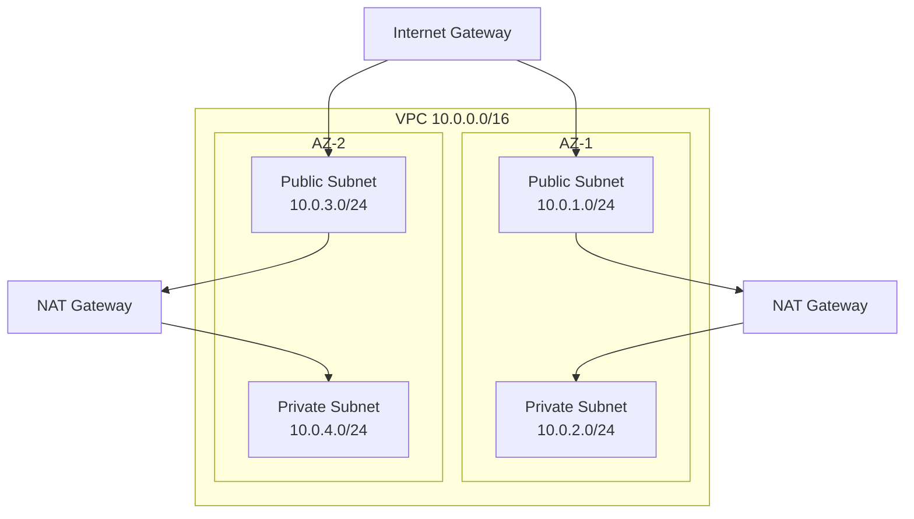
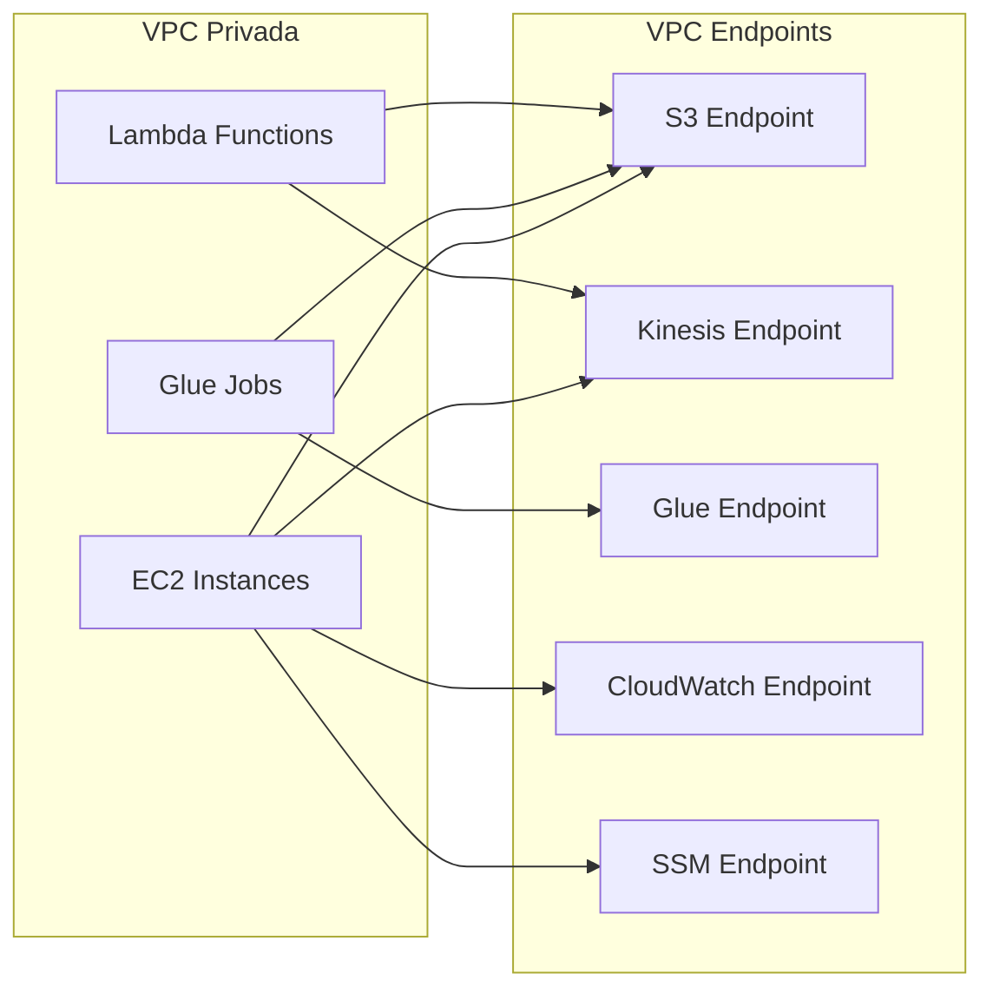
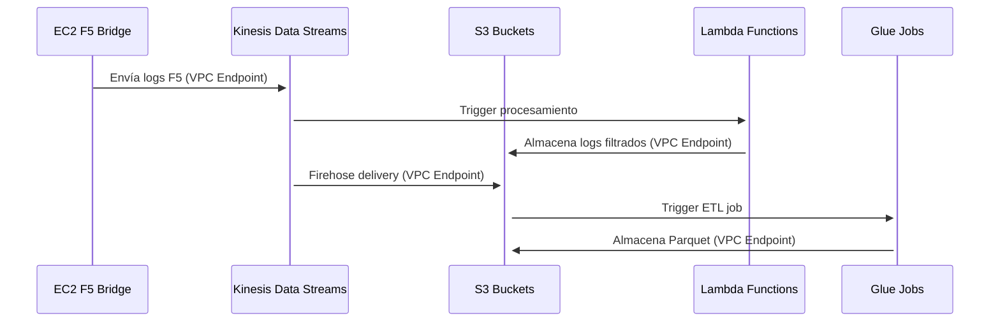

# Network Stack - Infraestructura de Red

## Descripción

El Network Stack proporciona la infraestructura de red base para todo el Data Lake, incluyendo VPC, subnets, security groups y VPC endpoints para comunicación segura con servicios AWS.

## Componentes Principales

### VPC (Virtual Private Cloud)
- **CIDR**: Configurable desde cdk.json (por defecto 10.0.0.0/16)
- **Zonas de Disponibilidad**: Mínimo 2 AZs requeridas para ALB
- **DNS**: Habilitado para resolución de nombres

### Configuración de Subnets



### Security Groups

#### Lambda Security Group
- **Propósito**: Proteger funciones Lambda de procesamiento
- **Reglas de Salida**: 
  - HTTPS (443) hacia servicios AWS
  - Acceso a Kinesis y S3
- **Reglas de Entrada**: Ninguna (Lambda no recibe tráfico directo)

#### Glue Security Group
- **Propósito**: Proteger jobs ETL de Glue
- **Reglas de Salida**:
  - HTTPS (443) hacia servicios AWS
  - Acceso a S3 y Glue Data Catalog
- **Reglas de Entrada**: Ninguna

#### EC2 Security Group
- **Propósito**: Proteger instancias EC2 F5 Bridge
- **Reglas de Salida**:
  - HTTPS (443) para Kinesis y S3
  - HTTP (80) para descargas
- **Reglas de Entrada**:
  - SSH (22) desde VPC para administración
  - SSM Session Manager

#### Grafana Security Group
- **Propósito**: Proteger instancia Grafana
- **Reglas de Salida**: HTTPS hacia CloudWatch
- **Reglas de Entrada**: HTTP (3000) desde VPC

### VPC Endpoints



#### S3 VPC Endpoint
- **Tipo**: Gateway Endpoint
- **Propósito**: Acceso privado a buckets S3
- **Beneficios**: Sin cargos por transferencia de datos

#### Kinesis VPC Endpoint
- **Tipo**: Interface Endpoint
- **Propósito**: Acceso privado a Kinesis Data Streams
- **Seguridad**: Tráfico cifrado dentro de VPC

#### Glue VPC Endpoint
- **Tipo**: Interface Endpoint
- **Propósito**: Acceso privado a Glue Data Catalog
- **Beneficios**: Mejor rendimiento para jobs ETL

#### CloudWatch VPC Endpoint
- **Tipo**: Interface Endpoint
- **Propósito**: Envío de métricas y logs
- **Seguridad**: Comunicación privada con CloudWatch

#### SSM VPC Endpoint
- **Tipo**: Interface Endpoint
- **Propósito**: Session Manager para EC2
- **Beneficios**: Acceso sin SSH keys o bastion hosts

## Flujo de Tráfico de Red



## Configuración de Seguridad

### Principios de Seguridad Aplicados
1. **Principio de Menor Privilegio**: Security groups con reglas mínimas necesarias
2. **Defensa en Profundidad**: Múltiples capas de seguridad
3. **Tráfico Privado**: VPC endpoints para evitar tráfico por internet
4. **Cifrado en Tránsito**: HTTPS/TLS para todas las comunicaciones

### Reglas de Security Groups Detalladas

#### Lambda Security Group
```
Outbound Rules:
- HTTPS (443) -> 0.0.0.0/0 (Servicios AWS)
- All Traffic -> VPC CIDR (Comunicación interna)

Inbound Rules:
- Ninguna (Lambda no recibe conexiones directas)
```

#### Glue Security Group
```
Outbound Rules:
- HTTPS (443) -> 0.0.0.0/0 (Servicios AWS)
- All Traffic -> VPC CIDR (Comunicación interna)

Inbound Rules:
- Ninguna (Jobs ETL no reciben conexiones directas)
```

#### EC2 Security Group
```
Outbound Rules:
- HTTPS (443) -> 0.0.0.0/0 (Servicios AWS)
- HTTP (80) -> 0.0.0.0/0 (Descargas)
- All Traffic -> VPC CIDR (Comunicación interna)

Inbound Rules:
- SSH (22) <- VPC CIDR (Administración)
- HTTPS (443) <- VPC CIDR (SSM Session Manager)
```

## Dependencias

### Stacks que Dependen de Network Stack
- **Compute Stack**: Requiere VPC y security groups para Lambda y Glue
- **EC2 Stack Enhanced**: Requiere VPC y security groups para instancias EC2
- **Visualization Stack**: Requiere VPC para Grafana

### Recursos Exportados
- **VPC**: Referencia para otros stacks
- **Security Groups**: Para Lambda, Glue, EC2 y Grafana
- **Subnets**: Públicas y privadas para distribución de recursos

## Configuración desde cdk.json

```json
{
  "networking": {
    "vpc_cidr": "10.0.0.0/16",
    "availability_zones": 2,
    "enable_nat_gateway": true,
    "enable_dns_hostnames": true,
    "enable_dns_support": true
  }
}
```

## Outputs del Stack

- **VPC ID**: Identificador de la VPC creada
- **Security Group IDs**: IDs de todos los security groups
- **Subnet IDs**: IDs de subnets públicas y privadas
- **VPC Endpoint IDs**: IDs de los VPC endpoints creados

## Consideraciones de Costos

### Componentes con Costo
- **NAT Gateways**: ~$45/mes por NAT Gateway
- **VPC Endpoints (Interface)**: ~$7.20/mes por endpoint
- **Transferencia de Datos**: Costos variables según uso

### Optimizaciones de Costo
- **VPC Endpoint Gateway para S3**: Sin costo adicional
- **Subnets Privadas**: Reducen transferencia de datos por internet
- **Security Groups**: Sin costo, mejor que NACLs para rendimiento

## Monitoreo y Troubleshooting

### Métricas Importantes
- **VPC Flow Logs**: Para análisis de tráfico de red
- **VPC Endpoint Metrics**: Para monitorear uso de endpoints
- **NAT Gateway Metrics**: Para optimizar costos de transferencia

### Logs Recomendados
- Habilitar VPC Flow Logs para troubleshooting
- CloudTrail para cambios en configuración de red
- CloudWatch para métricas de VPC endpoints
