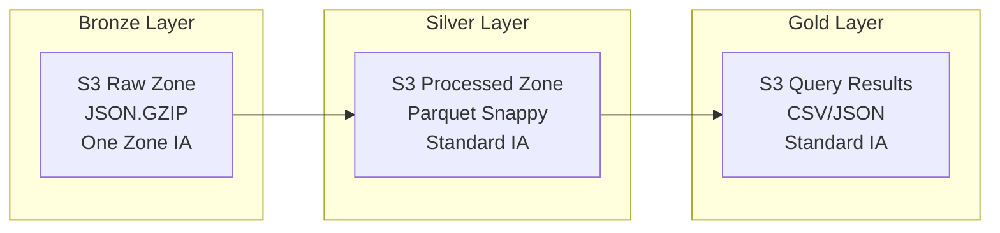
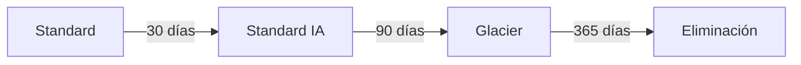
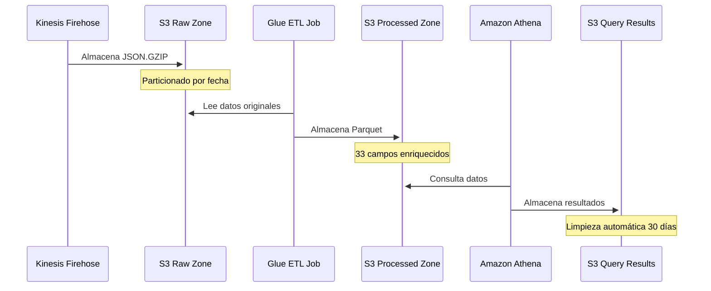
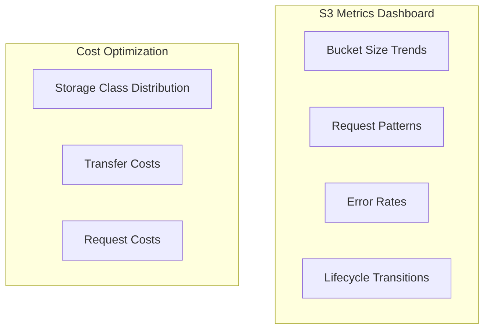

# Storage Stack - Infraestructura de Almacenamiento

## Descripción

El Storage Stack implementa la arquitectura Medallion (Bronze, Silver, Gold) utilizando buckets S3 optimizados para el Data Lake. Proporciona almacenamiento seguro, escalable y con políticas de lifecycle para optimización de costos.

## Arquitectura Medallion



## Componentes Principales

### S3 Raw Zone Bucket (Bronze Layer)
- **Propósito**: Almacenamiento de datos originales sin procesar
- **Formato**: JSON comprimido con GZIP
- **Clase de Almacenamiento**: One Zone IA (optimización de costos)
- **Particionamiento**: Por fecha de ingesta

#### Características Técnicas
```
Bucket Name: {prefix}-raw-zone
Encryption: S3 Managed (SSE-S3)
Versioning: Habilitado
Public Access: Bloqueado completamente
SSL Enforcement: Obligatorio
```

#### Estructura de Directorios
```
raw-zone/
├── year=2024/
│   ├── month=08/
│   │   ├── day=21/
│   │   │   ├── hour=13/
│   │   │   │   └── firehose_output.json.gz
│   │   │   └── hour=14/
│   │   └── day=22/
│   └── month=09/
└── errors/
    └── failed_records/
```

### S3 Processed Zone Bucket (Silver Layer)
- **Propósito**: Datos transformados y enriquecidos
- **Formato**: Parquet con compresión Snappy
- **Clase de Almacenamiento**: Standard IA
- **Particionamiento**: Optimizado para consultas Athena

#### Características Técnicas
```
Bucket Name: {prefix}-processed-zone
Encryption: S3 Managed (SSE-S3)
Versioning: Habilitado
Public Access: Bloqueado completamente
SSL Enforcement: Obligatorio
```

#### Estructura de Directorios
```
processed-zone/
├── f5-logs/
│   ├── year=2024/
│   │   ├── month=08/
│   │   │   ├── day=21/
│   │   │   │   ├── hour=13/
│   │   │   │   │   └── part-00000.parquet
│   │   │   │   └── hour=14/
│   │   │   └── day=22/
│   │   └── month=09/
│   └── errors/
│       └── year=2024/
└── other-datasets/
```

### S3 Query Results Bucket (Gold Layer)
- **Propósito**: Resultados de consultas Athena
- **Formato**: CSV, JSON según consulta
- **Clase de Almacenamiento**: Standard IA
- **Lifecycle**: Limpieza automática después de 30 días

#### Características Técnicas
```
Bucket Name: {prefix}-athena-results
Encryption: S3 Managed (SSE-S3)
Versioning: Habilitado
Public Access: Bloqueado completamente
SSL Enforcement: Obligatorio
```

## Políticas de Lifecycle

### Configuración de Transiciones



#### Regla de Lifecycle para Datos
```json
{
  "Rules": [
    {
      "Id": "DataLifecycleRule",
      "Status": "Enabled",
      "Transitions": [
        {
          "Days": 30,
          "StorageClass": "STANDARD_IA"
        },
        {
          "Days": 90,
          "StorageClass": "GLACIER"
        }
      ],
      "Expiration": {
        "Days": 365
      }
    }
  ]
}
```

#### Regla de Lifecycle para Query Results
```json
{
  "Rules": [
    {
      "Id": "QueryResultsLifecycle",
      "Status": "Enabled",
      "Expiration": {
        "Days": 30
      }
    }
  ]
}
```

## Flujo de Datos entre Buckets



## Configuración de Seguridad

### Cifrado
- **Tipo**: Server-Side Encryption con S3 Managed Keys (SSE-S3)
- **En Tránsito**: SSL/TLS obligatorio para todas las operaciones
- **En Reposo**: Cifrado automático de todos los objetos

### Control de Acceso
- **Public Access**: Completamente bloqueado
- **Bucket Policies**: Acceso solo desde VPC y roles específicos
- **IAM Roles**: Principio de menor privilegio

#### Ejemplo de Bucket Policy
```json
{
  "Version": "2012-10-17",
  "Statement": [
    {
      "Sid": "DenyInsecureConnections",
      "Effect": "Deny",
      "Principal": "*",
      "Action": "s3:*",
      "Resource": [
        "arn:aws:s3:::bucket-name",
        "arn:aws:s3:::bucket-name/*"
      ],
      "Condition": {
        "Bool": {
          "aws:SecureTransport": "false"
        }
      }
    }
  ]
}
```

## Optimización de Rendimiento

### Particionamiento Inteligente
- **Raw Zone**: Por fecha de ingesta (year/month/day/hour)
- **Processed Zone**: Por fecha de evento F5 (year/month/day/hour)
- **Partición Especial**: Directorio errors/ para logs con errores

### Formato de Datos Optimizado
- **Raw**: JSON.GZIP (balance entre compresión y velocidad)
- **Processed**: Parquet con Snappy (óptimo para consultas analíticas)
- **Compresión**: Reduce costos de almacenamiento y transferencia

### Prefijos Optimizados
```
Evitar prefijos secuenciales:
❌ 2024/08/21/13/data.json
✅ f5-logs/year=2024/month=08/day=21/hour=13/data.parquet
```

## Monitoreo y Métricas

### Métricas de S3 Importantes
- **BucketSizeBytes**: Tamaño total por bucket
- **NumberOfObjects**: Cantidad de objetos almacenados
- **AllRequests**: Número total de requests
- **GetRequests**: Requests de lectura
- **PutRequests**: Requests de escritura

### CloudWatch Dashboards


## Configuración desde cdk.json

```json
{
  "s3": {
    "lifecycle": {
      "transition_to_ia_days": 30,
      "transition_to_glacier_days": 90,
      "expiration_days": 365
    },
    "versioning": true,
    "encryption": "S3_MANAGED",
    "block_public_access": true
  }
}
```

## Dependencias

### Stacks que Utilizan Storage Stack
- **Streaming Stack**: Utiliza raw_bucket para Firehose delivery
- **Compute Stack**: Utiliza raw_bucket y processed_bucket para ETL
- **Analytics Stack**: Utiliza processed_bucket y athena_results_bucket
- **EC2 Stack Enhanced**: Utiliza raw_bucket para almacenar assets

### Recursos Exportados
- **raw_bucket**: Referencia al bucket de zona raw
- **processed_bucket**: Referencia al bucket de zona processed
- **athena_results_bucket**: Referencia al bucket de resultados

## Estimación de Costos

### Costos por Bucket (mensual)
```
Raw Zone Bucket:
- Almacenamiento One Zone IA: ~$1.50/TB
- Requests PUT: ~$0.01/1000 requests
- Requests GET: ~$0.001/1000 requests

Processed Zone Bucket:
- Almacenamiento Standard IA: ~$2.00/TB
- Compresión Parquet: 70-80% reducción vs JSON

Query Results Bucket:
- Almacenamiento Standard: ~$2.30/TB
- Lifecycle 30 días: Minimiza costos
```

### Optimizaciones de Costo Implementadas
1. **One Zone IA para Raw**: 20% más barato que Standard IA
2. **Compresión Parquet**: Reduce almacenamiento 70-80%
3. **Lifecycle Policies**: Transición automática a clases más baratas
4. **Limpieza Automática**: Query results eliminados después de 30 días

## Troubleshooting Común

### Problemas de Acceso
- Verificar bucket policies y IAM roles
- Confirmar que SSL está habilitado
- Revisar VPC endpoints para acceso privado

### Problemas de Rendimiento
- Verificar patrones de prefijos
- Monitorear request rates por prefijo
- Optimizar particionamiento según patrones de consulta

### Problemas de Costos
- Revisar métricas de storage class distribution
- Monitorear requests innecesarios
- Verificar configuración de lifecycle policies
