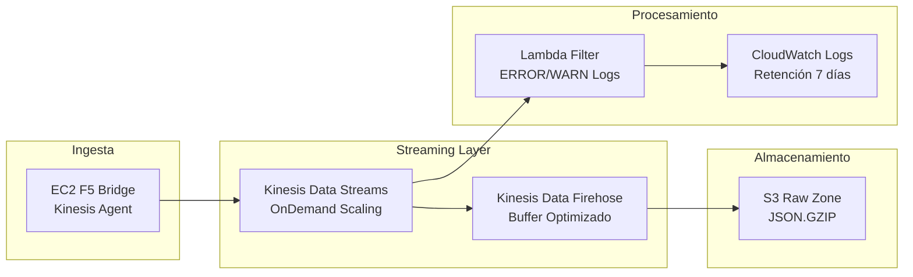
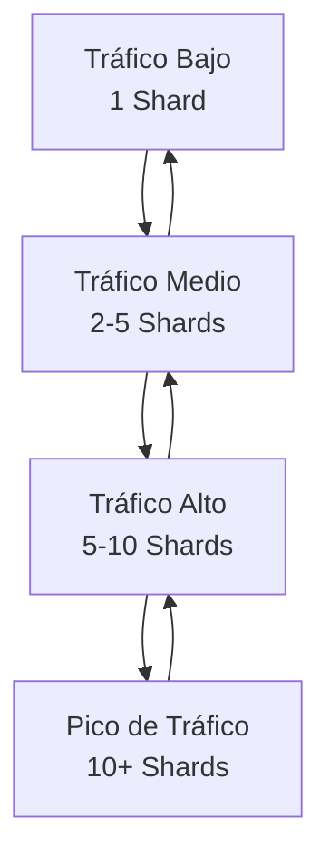
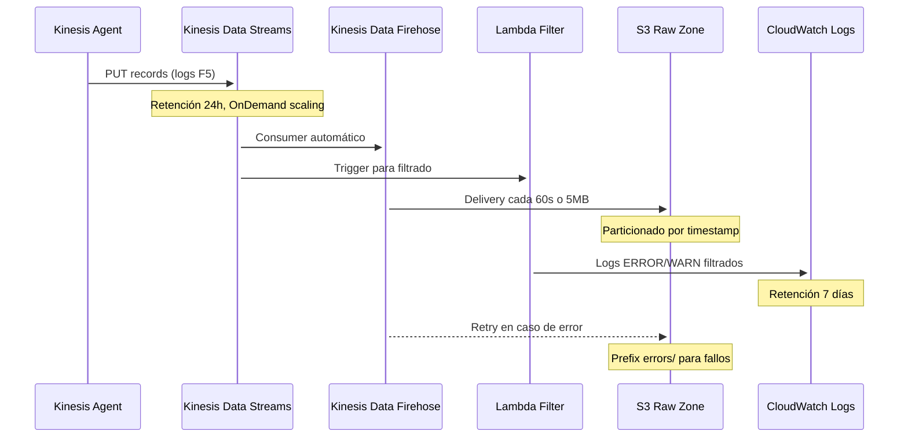
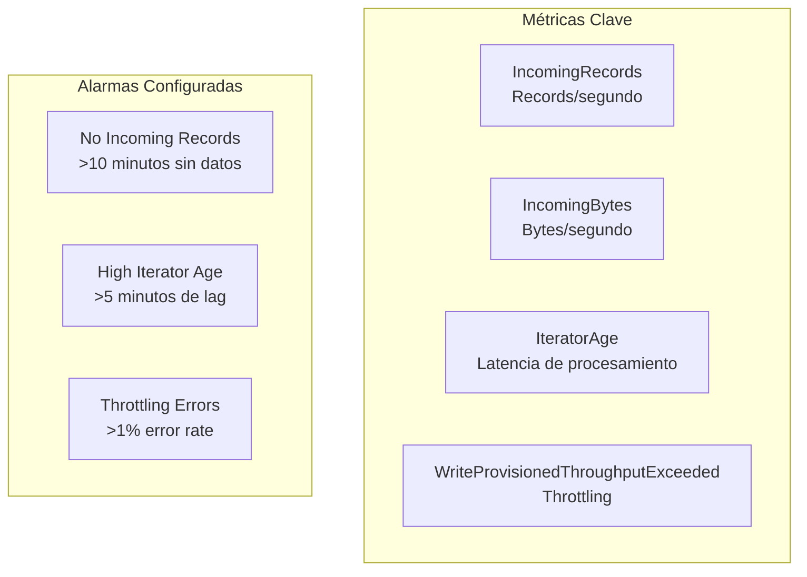
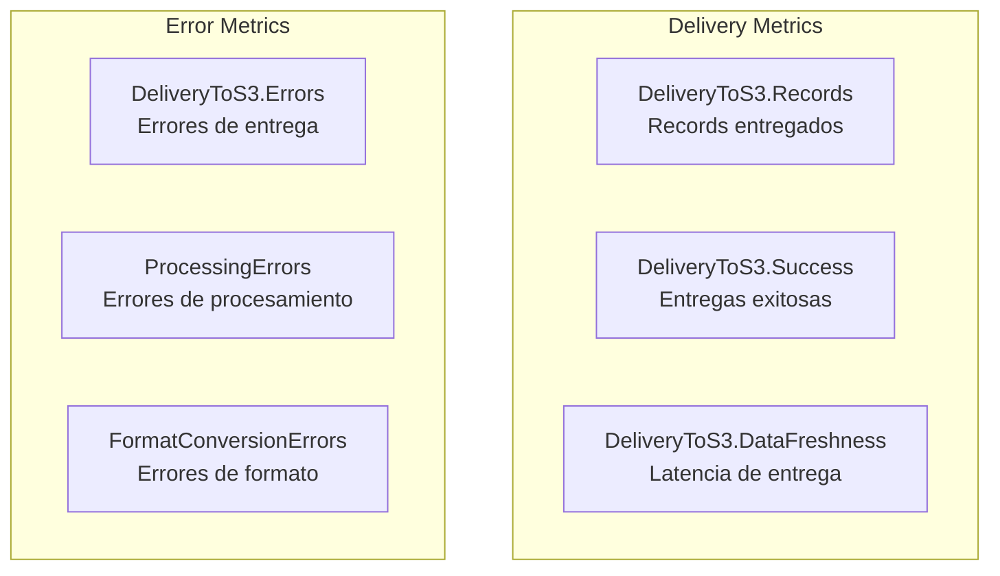
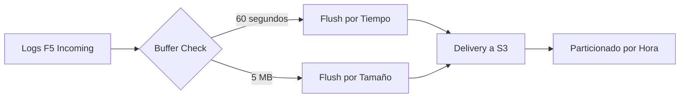

# Streaming Stack - Infraestructura de Streaming

## Descripción

El Streaming Stack implementa la ingesta de datos en tiempo real utilizando Amazon Kinesis Data Streams y Kinesis Data Firehose. Proporciona capacidades de streaming escalables y confiables para el procesamiento de logs F5 con buffer optimizado y delivery automático a S3.

## Arquitectura de Streaming



## Componentes Principales

### Kinesis Data Streams
- **Nombre**: `{prefix}-streaming`
- **Modo de Capacidad**: OnDemand (auto-scaling)
- **Retención**: 24 horas (configurable)
- **Cifrado**: En tránsito y en reposo

#### Características Técnicas
```
Stream Name: agesic-dl-poc-streaming
Shard Count: Auto-managed (OnDemand)
Retention Period: 24 hours
Encryption: Server-side encryption enabled
```

#### Configuración OnDemand


### Kinesis Data Firehose
- **Nombre**: `{prefix}-delivery-stream`
- **Destino**: S3 Raw Zone Bucket
- **Buffer**: Optimizado para balance entre latencia y eficiencia
- **Compresión**: GZIP para reducir costos de almacenamiento

#### Configuración de Buffer
```json
{
  "BufferInterval": 60,
  "BufferSize": 5,
  "CompressionFormat": "GZIP",
  "Prefix": "year=!{timestamp:yyyy}/month=!{timestamp:MM}/day=!{timestamp:dd}/hour=!{timestamp:HH}/",
  "ErrorOutputPrefix": "errors/"
}
```

#### Particionamiento Dinámico
```
Estructura de Salida:
s3://bucket/year=2024/month=08/day=21/hour=13/
├── firehose_output_2024-08-21-13-00-00-001.json.gz
├── firehose_output_2024-08-21-13-15-00-002.json.gz
└── firehose_output_2024-08-21-13-30-00-003.json.gz

Errores:
s3://bucket/errors/
└── processing-failed/
    └── error_records_2024-08-21-13-45-00.json
```

## Flujo de Datos Detallado



## Configuración de IAM y Seguridad

### Rol IAM para Firehose
```json
{
  "Version": "2012-10-17",
  "Statement": [
    {
      "Effect": "Allow",
      "Action": [
        "s3:AbortMultipartUpload",
        "s3:GetBucketLocation",
        "s3:GetObject",
        "s3:ListBucket",
        "s3:ListBucketMultipartUploads",
        "s3:PutObject"
      ],
      "Resource": [
        "arn:aws:s3:::raw-zone-bucket",
        "arn:aws:s3:::raw-zone-bucket/*"
      ]
    },
    {
      "Effect": "Allow",
      "Action": [
        "kinesis:DescribeStream",
        "kinesis:GetShardIterator",
        "kinesis:GetRecords"
      ],
      "Resource": "arn:aws:kinesis:region:account:stream/data-stream"
    },
    {
      "Effect": "Allow",
      "Action": [
        "logs:CreateLogGroup",
        "logs:CreateLogStream",
        "logs:PutLogEvents"
      ],
      "Resource": "arn:aws:logs:region:account:log-group:/aws/kinesisfirehose/*"
    }
  ]
}
```

### Cifrado y Seguridad
- **Kinesis Data Streams**: Cifrado server-side con AWS KMS
- **Kinesis Data Firehose**: Cifrado en tránsito con SSL/TLS
- **S3 Delivery**: Cifrado automático en destino
- **VPC Endpoints**: Tráfico privado sin salir de AWS

## Monitoreo y Métricas

### Métricas de Kinesis Data Streams


### Métricas de Kinesis Data Firehose


### CloudWatch Dashboard
```json
{
  "widgets": [
    {
      "type": "metric",
      "properties": {
        "metrics": [
          ["AWS/Kinesis", "IncomingRecords", "StreamName", "agesic-dl-poc-streaming"],
          ["AWS/KinesisFirehose", "DeliveryToS3.Records", "DeliveryStreamName", "agesic-dl-poc-delivery"]
        ],
        "period": 300,
        "stat": "Sum",
        "region": "us-east-2",
        "title": "Ingesta de Logs F5"
      }
    }
  ]
}
```

## Configuración de Buffer Optimizada

### Estrategia de Buffer


### Parámetros de Optimización
```yaml
buffer_configuration:
  size_mb: 5          # Balance entre latencia y eficiencia
  interval_seconds: 60 # Máximo 1 minuto de latencia
  
compression:
  format: GZIP        # Reduce costos de almacenamiento ~70%
  
partitioning:
  dynamic: true       # Particionado automático por timestamp
  format: "year=!{timestamp:yyyy}/month=!{timestamp:MM}/day=!{timestamp:dd}/hour=!{timestamp:HH}/"
  
error_handling:
  retry_attempts: 3   # Reintentos automáticos
  error_prefix: "errors/"
```

## Escalabilidad y Rendimiento

### Capacidad OnDemand
- **Auto-scaling**: Ajuste automático según carga
- **Sin Provisioning**: No requiere planificación de capacidad
- **Costo Optimizado**: Pago por uso real

### Límites y Consideraciones
```
Kinesis Data Streams (OnDemand):
- Throughput: Hasta 200 MB/s o 200,000 records/s por shard
- Scaling: Automático basado en throughput
- Latency: <200ms para PUT operations

Kinesis Data Firehose:
- Throughput: Hasta 5,000 records/s por delivery stream
- Buffer: 1MB - 128MB (configurado en 5MB)
- Latency: 60s - 900s (configurado en 60s)
```

## Configuración desde cdk.json

```json
{
  "kinesis": {
    "shard_count": 1,
    "retention_hours": 24,
    "firehose": {
      "buffer_size_mb": 5,
      "buffer_interval_seconds": 60,
      "compression_format": "GZIP",
      "error_output_prefix": "errors/"
    }
  }
}
```

## Dependencias

### Dependencias de Entrada
- **Storage Stack**: Requiere raw_bucket para Firehose delivery

### Stacks que Dependen de Streaming Stack
- **Compute Stack**: Utiliza data_stream para Lambda triggers
- **EC2 Stack Enhanced**: Utiliza data_stream para envío de logs

### Recursos Exportados
- **data_stream**: Referencia al Kinesis Data Stream
- **delivery_stream**: Referencia al Kinesis Data Firehose

## Troubleshooting Común

### Problemas de Ingesta
```bash
# Verificar métricas de stream
aws cloudwatch get-metric-statistics \
  --namespace AWS/Kinesis \
  --metric-name IncomingRecords \
  --dimensions Name=StreamName,Value=agesic-dl-poc-streaming \
  --start-time 2024-08-21T12:00:00Z \
  --end-time 2024-08-21T13:00:00Z \
  --period 300 \
  --statistics Sum
```

### Problemas de Delivery
```bash
# Verificar logs de Firehose
aws logs describe-log-streams \
  --log-group-name /aws/kinesisfirehose/agesic-dl-poc-delivery \
  --order-by LastEventTime \
  --descending
```

### Problemas de Rendimiento
- **High Iterator Age**: Indica lag en procesamiento de consumers
- **Throttling**: Requiere ajuste de capacidad o optimización de productores
- **Delivery Errors**: Revisar permisos IAM y configuración de S3

## Estimación de Costos

### Costos Mensuales Estimados
```
Kinesis Data Streams (OnDemand):
- Shard Hour: $0.015/hora por shard
- PUT Payload Units: $0.014 por millón de unidades
- Estimado mensual: ~$11.00

Kinesis Data Firehose:
- Records Ingested: $0.029 por GB
- Format Conversion: $0.018 por GB (si aplica)
- Estimado mensual: ~$8.50

Total Streaming: ~$19.50/mes
```

### Optimizaciones de Costo
1. **OnDemand Scaling**: Solo paga por capacidad utilizada
2. **Compresión GZIP**: Reduce costos de almacenamiento S3
3. **Buffer Optimizado**: Reduce número de objetos S3
4. **Retención 24h**: Minimiza costos de almacenamiento en stream
