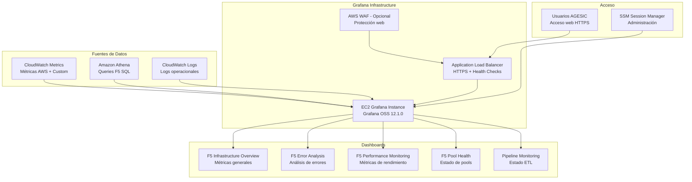

# Visualization Stack - Infraestructura de Visualización

## Descripción

El Visualization Stack proporciona capacidades de visualización y dashboards para el Data Lake F5 utilizando Grafana OSS. Implementa una solución simplificada pero robusta para visualización de métricas, análisis de logs F5 y monitoreo operacional del pipeline de datos.

## Arquitectura de Visualización



## Componentes Principales

### Grafana OSS Instance
- **Versión**: Grafana OSS 12.1.0
- **Tipo EC2**: t3.medium (2 vCPU, 4 GB RAM)
- **Storage**: 20 GB gp3 EBS
- **OS**: Amazon Linux 2023

#### Configuración de Grafana
```yaml
grafana_configuration:
  version: "12.1.0"
  installation_method: "rpm_package"
  
  server:
    http_port: 3000
    domain: "grafana.agesic-dl-poc.local"
    root_url: "https://grafana.agesic-dl-poc.local"
    
  security:
    admin_user: "admin"
    admin_password: "generated_secure_password"
    secret_key: "generated_secret_key"
    
  database:
    type: "sqlite3"
    path: "/var/lib/grafana/grafana.db"
    
  auth:
    disable_login_form: false
    disable_signout_menu: false
    
  users:
    allow_sign_up: false
    auto_assign_org: true
    auto_assign_org_role: "Viewer"
```

### Security Group Grafana
- **Puerto 3000**: Acceso HTTP desde VPC
- **Puerto 443**: HTTPS desde ALB
- **Outbound**: HTTPS hacia AWS services

#### Reglas de Security Group
```yaml
security_group_rules:
  ingress:
    - port: 3000
      protocol: "tcp"
      source: "VPC_CIDR"
      description: "Grafana HTTP from VPC"
      
    - port: 443
      protocol: "tcp" 
      source: "ALB_SECURITY_GROUP"
      description: "HTTPS from ALB"
      
  egress:
    - port: 443
      protocol: "tcp"
      destination: "0.0.0.0/0"
      description: "HTTPS to AWS services"
      
    - port: 80
      protocol: "tcp"
      destination: "0.0.0.0/0"
      description: "HTTP for package updates"
```

## Data Sources Configurados

### CloudWatch Data Source
```yaml
# CloudWatch para métricas AWS y custom
datasources:
  - name: "CloudWatch F5 Metrics"
    type: "cloudwatch"
    url: "https://monitoring.us-east-2.amazonaws.com"
    access: "proxy"
    
    jsonData:
      defaultRegion: "us-east-2"
      customMetricsNamespaces: "AGESIC-DL-POC/F5Analytics,AWS/Kinesis,AWS/Lambda,AWS/Glue,AWS/KinesisFirehose"
      
    secureJsonData:
      accessKey: "${AWS_ACCESS_KEY_ID}"
      secretKey: "${AWS_SECRET_ACCESS_KEY}"
```

### Athena Data Source
```yaml
# Athena para queries SQL F5
datasources:
  - name: "Athena F5 Analytics"
    type: "athena"
    url: "https://athena.us-east-2.amazonaws.com"
    access: "proxy"
    
    jsonData:
      defaultRegion: "us-east-2"
      workgroup: "agesic-dl-poc-f5-analytics-wg"
      database: "agesic_dl_poc_database"
      outputLocation: "s3://agesic-dl-poc-athena-results/grafana/"
      
    secureJsonData:
      accessKey: "${AWS_ACCESS_KEY_ID}"
      secretKey: "${AWS_SECRET_ACCESS_KEY}"
```

### CloudWatch Logs Data Source
```yaml
# CloudWatch Logs para análisis de logs
datasources:
  - name: "CloudWatch Logs"
    type: "cloudwatch-logs"
    url: "https://logs.us-east-2.amazonaws.com"
    access: "proxy"
    
    jsonData:
      defaultRegion: "us-east-2"
      
    secureJsonData:
      accessKey: "${AWS_ACCESS_KEY_ID}"
      secretKey: "${AWS_SECRET_ACCESS_KEY}"
```

## Dashboards Predefinidos

### 1. F5 Infrastructure Overview
```json
{
  "dashboard": {
    "title": "F5 Infrastructure Overview",
    "tags": ["f5", "infrastructure", "overview"],
    "time": {
      "from": "now-1h",
      "to": "now"
    },
    "panels": [
      {
        "title": "Request Volume",
        "type": "stat",
        "targets": [
          {
            "datasource": "CloudWatch F5 Metrics",
            "namespace": "AWS/Kinesis",
            "metricName": "IncomingRecords",
            "dimensions": {
              "StreamName": "agesic-dl-poc-streaming"
            },
            "statistic": "Sum"
          }
        ]
      },
      {
        "title": "Error Rate",
        "type": "stat",
        "targets": [
          {
            "datasource": "CloudWatch F5 Metrics",
            "namespace": "AGESIC-DL-POC/F5Analytics",
            "metricName": "F5ErrorRate",
            "statistic": "Average"
          }
        ]
      }
    ]
  }
}
```

### 2. F5 Error Analysis Dashboard
```json
{
  "dashboard": {
    "title": "F5 Error Analysis",
    "tags": ["f5", "errors", "analysis"],
    "panels": [
      {
        "title": "Error Distribution by Pool",
        "type": "piechart",
        "targets": [
          {
            "datasource": "Athena F5 Analytics",
            "rawSql": "SELECT ambiente_pool as pool_name, COUNT(*) as error_count FROM f5_logs WHERE is_error = true AND $__timeFilter(parsed_timestamp_apache) GROUP BY ambiente_pool ORDER BY error_count DESC LIMIT 10"
          }
        ]
      },
      {
        "title": "Error Timeline",
        "type": "timeseries",
        "targets": [
          {
            "datasource": "Athena F5 Analytics", 
            "rawSql": "SELECT parsed_timestamp_apache as time, COUNT(*) as errors FROM f5_logs WHERE is_error = true AND $__timeFilter(parsed_timestamp_apache) GROUP BY parsed_timestamp_apache ORDER BY time"
          }
        ]
      }
    ]
  }
}
```

### 3. F5 Performance Monitoring Dashboard
```json
{
  "dashboard": {
    "title": "F5 Performance Monitoring",
    "tags": ["f5", "performance", "monitoring"],
    "panels": [
      {
        "title": "Response Time Percentiles",
        "type": "timeseries",
        "targets": [
          {
            "datasource": "CloudWatch F5 Metrics",
            "namespace": "AGESIC-DL-POC/F5Analytics",
            "metricName": "F5AverageResponseTime",
            "statistic": "Average",
            "alias": "Average"
          },
          {
            "datasource": "CloudWatch F5 Metrics",
            "namespace": "AGESIC-DL-POC/F5Analytics", 
            "metricName": "F5P95ResponseTime",
            "statistic": "Average",
            "alias": "P95"
          }
        ]
      },
      {
        "title": "Slow Requests Rate",
        "type": "stat",
        "targets": [
          {
            "datasource": "Athena F5 Analytics",
            "rawSql": "SELECT (SUM(CASE WHEN is_slow = true THEN 1 ELSE 0 END) * 100.0 / COUNT(*)) as slow_rate FROM f5_logs WHERE $__timeFilter(parsed_timestamp_apache)"
          }
        ]
      }
    ]
  }
}
```

### 4. F5 Pool Health Dashboard
```json
{
  "dashboard": {
    "title": "F5 Pool Health Monitoring",
    "tags": ["f5", "pools", "health"],
    "panels": [
      {
        "title": "Pool Health Scores",
        "type": "table",
        "targets": [
          {
            "datasource": "Athena F5 Analytics",
            "rawSql": "SELECT ambiente_pool as pool_name, AVG(GREATEST(0, 100 - (SUM(CASE WHEN is_error = true THEN 1 ELSE 0 END) * 100.0 / COUNT(*)) * 2 - (SUM(CASE WHEN is_slow = true THEN 1 ELSE 0 END) * 100.0 / COUNT(*)) - LEAST(50, AVG(tiempo_respuesta_ms) / 20))) as health_score FROM f5_logs WHERE $__timeFilter(parsed_timestamp_apache) GROUP BY ambiente_pool ORDER BY health_score ASC"
          }
        ]
      },
      {
        "title": "Pool Health Trend",
        "type": "timeseries",
        "targets": [
          {
            "datasource": "CloudWatch F5 Metrics",
            "namespace": "AGESIC-DL-POC/F5Analytics",
            "metricName": "F5PoolHealthScore",
            "statistic": "Average"
          }
        ]
      }
    ]
  }
}
```

### 5. Pipeline Monitoring Dashboard
```json
{
  "dashboard": {
    "title": "Data Pipeline Monitoring",
    "tags": ["pipeline", "etl", "monitoring"],
    "panels": [
      {
        "title": "Kinesis Ingestion Rate",
        "type": "timeseries",
        "targets": [
          {
            "datasource": "CloudWatch F5 Metrics",
            "namespace": "AWS/Kinesis",
            "metricName": "IncomingRecords",
            "dimensions": {
              "StreamName": "agesic-dl-poc-streaming"
            },
            "statistic": "Sum"
          }
        ]
      },
      {
        "title": "Lambda Processing Duration",
        "type": "timeseries",
        "targets": [
          {
            "datasource": "CloudWatch F5 Metrics",
            "namespace": "AWS/Lambda",
            "metricName": "Duration",
            "dimensions": {
              "FunctionName": "agesic-dl-poc-log-filter"
            },
            "statistic": "Average"
          }
        ]
      },
      {
        "title": "Glue ETL Job Status",
        "type": "stat",
        "targets": [
          {
            "datasource": "CloudWatch F5 Metrics",
            "namespace": "AWS/Glue",
            "metricName": "glue.driver.aggregate.numCompletedTasks",
            "dimensions": {
              "JobName": "agesic-dl-poc-f5-etl-multiformat"
            },
            "statistic": "Sum"
          }
        ]
      }
    ]
  }
}
```

## Instalación y Configuración

### User Data Script
```bash
#!/bin/bash
# User Data para instalación automática de Grafana

yum update -y

# Instalar Grafana OSS
cat > /etc/yum.repos.d/grafana.repo << 'EOF'
[grafana]
name=grafana
baseurl=https://rpm.grafana.com
repo_gpgcheck=1
enabled=1
gpgcheck=1
gpgkey=https://rpm.grafana.com/gpg.key
sslverify=1
sslcacert=/etc/pki/tls/certs/ca-bundle.crt
EOF

yum install -y grafana

# Configurar Grafana
cat > /etc/grafana/grafana.ini << 'EOF'
[server]
http_port = 3000
domain = grafana.agesic-dl-poc.local
root_url = https://grafana.agesic-dl-poc.local

[security]
admin_user = admin
admin_password = AgesicF5Analytics2024!
secret_key = agesic_dl_poc_secret_key_2024

[database]
type = sqlite3
path = /var/lib/grafana/grafana.db

[auth]
disable_login_form = false

[users]
allow_sign_up = false
auto_assign_org = true
auto_assign_org_role = Viewer
EOF

# Instalar plugins necesarios
grafana-cli plugins install grafana-athena-datasource
grafana-cli plugins install grafana-cloudwatch-datasource

# Iniciar servicios
systemctl enable grafana-server
systemctl start grafana-server

# Instalar CloudWatch Agent
yum install -y amazon-cloudwatch-agent

# Configurar CloudWatch Agent
cat > /opt/aws/amazon-cloudwatch-agent/etc/amazon-cloudwatch-agent.json << 'EOF'
{
  "agent": {
    "metrics_collection_interval": 60
  },
  "metrics": {
    "namespace": "AGESIC-DL-POC/Grafana",
    "metrics_collected": {
      "cpu": {
        "measurement": ["cpu_usage_idle", "cpu_usage_user", "cpu_usage_system"],
        "metrics_collection_interval": 60
      },
      "mem": {
        "measurement": ["mem_used_percent"],
        "metrics_collection_interval": 60
      }
    }
  }
}
EOF

systemctl enable amazon-cloudwatch-agent
systemctl start amazon-cloudwatch-agent
```

### Configuración de Data Sources Automática
```bash
#!/bin/bash
# Script para configurar data sources automáticamente

GRAFANA_URL="http://localhost:3000"
ADMIN_USER="admin"
ADMIN_PASS="AgesicF5Analytics2024!"

# Esperar a que Grafana esté listo
sleep 30

# Configurar CloudWatch Data Source
curl -X POST \
  -H "Content-Type: application/json" \
  -d '{
    "name": "CloudWatch F5 Metrics",
    "type": "cloudwatch",
    "url": "https://monitoring.us-east-2.amazonaws.com",
    "access": "proxy",
    "jsonData": {
      "defaultRegion": "us-east-2",
      "customMetricsNamespaces": "AGESIC-DL-POC/F5Analytics,AWS/Kinesis,AWS/Lambda,AWS/Glue"
    },
    "secureJsonData": {
      "accessKey": "'$AWS_ACCESS_KEY_ID'",
      "secretKey": "'$AWS_SECRET_ACCESS_KEY'"
    }
  }' \
  "http://$ADMIN_USER:$ADMIN_PASS@$GRAFANA_URL/api/datasources"

# Configurar Athena Data Source
curl -X POST \
  -H "Content-Type: application/json" \
  -d '{
    "name": "Athena F5 Analytics",
    "type": "athena",
    "url": "https://athena.us-east-2.amazonaws.com",
    "access": "proxy",
    "jsonData": {
      "defaultRegion": "us-east-2",
      "workgroup": "agesic-dl-poc-f5-analytics-wg",
      "database": "agesic_dl_poc_database",
      "outputLocation": "s3://agesic-dl-poc-athena-results/grafana/"
    },
    "secureJsonData": {
      "accessKey": "'$AWS_ACCESS_KEY_ID'",
      "secretKey": "'$AWS_SECRET_ACCESS_KEY'"
    }
  }' \
  "http://$ADMIN_USER:$ADMIN_PASS@$GRAFANA_URL/api/datasources"
```

## Application Load Balancer (Opcional)

### Configuración ALB
```yaml
alb_configuration:
  name: "agesic-dl-poc-grafana-alb"
  scheme: "internet-facing"
  type: "application"
  
  listeners:
    - port: 443
      protocol: "HTTPS"
      ssl_policy: "ELBSecurityPolicy-TLS-1-2-2017-01"
      certificate_arn: "arn:aws:acm:us-east-2:123456789012:certificate/xxx"
      
      default_actions:
        - type: "forward"
          target_group_arn: "arn:aws:elasticloadbalancing:us-east-2:123456789012:targetgroup/grafana-tg/xxx"
          
  target_group:
    name: "agesic-dl-poc-grafana-tg"
    port: 3000
    protocol: "HTTP"
    health_check:
      path: "/api/health"
      interval: 30
      timeout: 5
      healthy_threshold: 2
      unhealthy_threshold: 3
```

## AWS WAF (Opcional)

### Configuración WAF
```yaml
waf_configuration:
  name: "agesic-dl-poc-grafana-waf"
  scope: "REGIONAL"
  
  rules:
    - name: "AWSManagedRulesCommonRuleSet"
      priority: 1
      managed_rule_group:
        vendor_name: "AWS"
        name: "AWSManagedRulesCommonRuleSet"
        
    - name: "RateLimitRule"
      priority: 2
      rate_based_statement:
        limit: 2000
        aggregate_key_type: "IP"
        
  default_action: "ALLOW"
  
  association:
    resource_arn: "arn:aws:elasticloadbalancing:us-east-2:123456789012:loadbalancer/app/agesic-dl-poc-grafana-alb/xxx"
```

## Monitoreo de Grafana

### Métricas de Sistema
```yaml
grafana_monitoring:
  cloudwatch_metrics:
    - namespace: "AGESIC-DL-POC/Grafana"
      metrics:
        - "CPUUtilization"
        - "MemoryUtilization"
        - "DiskUtilization"
        
  health_checks:
    - endpoint: "/api/health"
      expected_status: 200
      interval: 60
      
  log_monitoring:
    - log_group: "/var/log/grafana/grafana.log"
      error_patterns:
        - "ERROR"
        - "FATAL"
        - "panic"
```

### Alertas Grafana
```yaml
grafana_alerts:
  - name: "Grafana High CPU"
    condition: "CPUUtilization > 80%"
    evaluation_interval: "1m"
    notification_channels: ["email", "sns"]
    
  - name: "Grafana Memory Usage"
    condition: "MemoryUtilization > 85%"
    evaluation_interval: "1m"
    notification_channels: ["email"]
    
  - name: "Grafana Service Down"
    condition: "Health Check Failed"
    evaluation_interval: "30s"
    notification_channels: ["email", "sns"]
```

## Dependencias

### Dependencias de Entrada
- **Network Stack**: VPC para despliegue de Grafana

### Stacks que Dependen de Visualization Stack
- Ninguno (stack independiente de visualización)

### Recursos Exportados
- **grafana_instance_id**: ID de la instancia EC2 Grafana
- **grafana_security_group_id**: ID del security group
- **grafana_url**: URL de acceso a Grafana (si ALB configurado)

## Estimación de Costos

### Costos Grafana (mensual)
```
EC2 Instance (t3.medium):
- OnDemand: $0.0416/hora x 24 x 30 = $29.95/mes
- Spot (opcional): ~$9.00/mes (70% descuento)

EBS Storage:
- 20GB gp3: $1.60/mes

Application Load Balancer (opcional):
- ALB: $16.20/mes (0.0225/hora)
- Target Group: Incluido

AWS WAF (opcional):
- Web ACL: $1.00/mes
- Rules: $1.00/mes por regla

CloudWatch:
- Métricas custom: $0.30/mes por métrica
- Logs: ~$0.50/mes

Total Visualization Stack:
- Básico (solo EC2): ~$32.05/mes
- Completo (con ALB + WAF): ~$51.25/mes
```

### Optimizaciones de Costo
1. **Spot Instances**: Para entornos no críticos
2. **Scheduling**: Apagar instancia fuera de horario laboral
3. **Right-sizing**: t3.small para cargas ligeras
4. **ALB Opcional**: Solo si se requiere acceso externo

## Troubleshooting Común

### Problemas de Grafana
```bash
# Verificar estado del servicio
sudo systemctl status grafana-server

# Verificar logs
sudo tail -f /var/log/grafana/grafana.log

# Reiniciar servicio
sudo systemctl restart grafana-server

# Verificar configuración
sudo grafana-cli admin reset-admin-password newpassword
```

### Problemas de Data Sources
```bash
# Verificar conectividad AWS
aws sts get-caller-identity

# Verificar permisos CloudWatch
aws cloudwatch list-metrics --namespace "AGESIC-DL-POC/F5Analytics"

# Verificar Athena
aws athena list-work-groups
```

### Problemas de Performance
```bash
# Verificar recursos del sistema
top
free -m
df -h

# Verificar conectividad de red
curl -I http://localhost:3000/api/health

# Verificar logs de acceso
sudo tail -f /var/log/grafana/grafana.log | grep "HTTP"
```

## Acceso y Administración

### Acceso via SSM Session Manager
```bash
# Conectar a instancia Grafana
aws ssm start-session --target i-1234567890abcdef0

# Una vez conectado
sudo systemctl status grafana-server
sudo tail -f /var/log/grafana/grafana.log
```

### Configuración Inicial
1. Acceder a http://instance-ip:3000
2. Login: admin / AgesicF5Analytics2024!
3. Configurar data sources
4. Importar dashboards predefinidos
5. Configurar usuarios y permisos

### Backup y Restore
```bash
# Backup de configuración Grafana
sudo cp -r /var/lib/grafana /backup/grafana-$(date +%Y%m%d)

# Backup de base de datos
sudo sqlite3 /var/lib/grafana/grafana.db ".backup /backup/grafana-db-$(date +%Y%m%d).db"

# Restore
sudo systemctl stop grafana-server
sudo cp -r /backup/grafana-20240821/* /var/lib/grafana/
sudo systemctl start grafana-server
```
